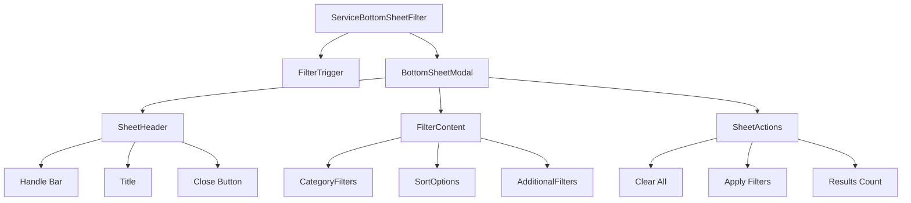

# Mobile Bottom Sheet Filter Component - Technical Specification

## Executive Summary

This specification outlines the design and architecture for a mobile-friendly bottom sheet component to replace the current dropdown-based service filtering in the ServiceCategoriesView. The component will provide a modern, touch-optimized filtering experience that follows mobile UX best practices while maintaining accessibility and performance standards.

## Current State Analysis

### Existing Implementation

- **Location**: `src/views/ServiceCategoriesView.vue` (lines 34-93)
- **Current Pattern**: Simple dropdown with category filter options
- **Limitations**:
  - Not optimized for mobile touch interaction
  - Limited screen real estate usage
  - No advanced filtering capabilities
  - Poor discoverability of filter options

### Current Filter Logic

```javascript
// Current filtering state
const selectedCategoryFilter = ref(null);
const isFilterDropdownOpen = ref(false);

// Filter methods
const applyCategoryFilter = async (categoryId) => {
  /* ... */
};
const clearCategoryFilter = () => {
  /* ... */
};
const toggleFilterDropdown = () => {
  /* ... */
};
```

## Component Architecture

### 1. Component Structure



### 2. File Structure

```
src/components/ui/
├── BottomSheet/
│   ├── BottomSheet.vue              # Core bottom sheet component
│   ├── BottomSheetHeader.vue        # Header with handle and title
│   ├── BottomSheetContent.vue       # Scrollable content area
│   └── BottomSheetActions.vue       # Action buttons area
├── ServiceBottomSheetFilter.vue     # Service-specific filter implementation
└── FilterChip.vue                   # Reusable filter chip component
```

## Technical Specifications

### 3. Core Bottom Sheet Component API

```typescript
interface BottomSheetProps {
  modelValue: boolean; // v-model for open/close state
  height?: 'auto' | 'half' | 'full'; // Sheet height variants
  snapPoints?: number[]; // Custom snap points (0-100%)
  backdrop?: boolean; // Show backdrop overlay
  persistent?: boolean; // Prevent dismiss on backdrop click
  swipeToClose?: boolean; // Enable swipe-to-dismiss
  showHandle?: boolean; // Show drag handle
  title?: string; // Sheet title
  closeOnEscape?: boolean; // Close on ESC key
}

interface BottomSheetEmits {
  'update:modelValue': (value: boolean) => void;
  open: () => void;
  close: () => void;
  'backdrop-click': () => void;
}
```

### 4. Service Filter Component API

```typescript
interface ServiceFilterProps {
  modelValue: ServiceFilters; // Current filter state
  categories: ServiceCategory[]; // Available categories
  loading?: boolean; // Loading state
  resultCount?: number; // Current result count
}

interface ServiceFilters {
  categoryId: string | null;
  sortBy: 'popularity' | 'name' | 'newest';
  priceRange?: [number, number];
  availability?: 'all' | 'available' | 'busy';
  rating?: number;
}

interface ServiceFilterEmits {
  'update:modelValue': (filters: ServiceFilters) => void;
  apply: (filters: ServiceFilters) => void;
  clear: () => void;
}
```

## Animation System Design

### 5. CSS Transitions vs JavaScript Animation

**Recommendation: CSS Transitions with JavaScript coordination**

```css
/* Primary animations using CSS for performance */
.bottom-sheet-enter-active,
.bottom-sheet-leave-active {
  transition: transform 0.3s cubic-bezier(0.32, 0.72, 0, 1);
}

.bottom-sheet-enter-from,
.bottom-sheet-leave-to {
  transform: translateY(100%);
}

/* Backdrop animations */
.backdrop-enter-active,
.backdrop-leave-active {
  transition: opacity 0.25s ease-out;
}

.backdrop-enter-from,
.backdrop-leave-to {
  opacity: 0;
}
```

**Animation Timeline:**

1. **Opening**: Backdrop fade-in (250ms) → Sheet slide-up (300ms)
2. **Closing**: Sheet slide-down (300ms) → Backdrop fade-out (250ms)
3. **Snap animations**: 200ms duration for smooth snapping

### 6. Touch Gesture Implementation

```javascript
// Touch gesture handling without external dependencies
const useTouchGestures = () => {
  const startY = ref(0);
  const currentY = ref(0);
  const isDragging = ref(false);
  const velocity = ref(0);

  const handleTouchStart = (event) => {
    startY.value = event.touches[0].clientY;
    isDragging.value = true;
    // Trigger haptic feedback
    triggerSelection();
  };

  const handleTouchMove = (event) => {
    if (!isDragging.value) return;
    currentY.value = event.touches[0].clientY;
    const deltaY = currentY.value - startY.value;

    // Apply resistance for upward swipes
    const resistance = deltaY < 0 ? 0.3 : 1;
    const translationY = Math.max(0, deltaY * resistance);

    // Update sheet position
    updateSheetPosition(translationY);
  };

  const handleTouchEnd = () => {
    if (!isDragging.value) return;

    const deltaY = currentY.value - startY.value;
    const shouldClose = deltaY > 100 || velocity.value > 0.5;

    if (shouldClose) {
      closeSheet();
    } else {
      snapToPosition();
    }

    isDragging.value = false;
  };

  return {
    handleTouchStart,
    handleTouchMove,
    handleTouchEnd,
  };
};
```

## Accessibility Implementation

### 7. ARIA Labels and Focus Management

```html
<div
  role="dialog"
  aria-modal="true"
  :aria-labelledby="titleId"
  :aria-describedby="descriptionId"
  class="bottom-sheet"
>
  <div class="bottom-sheet-header">
    <div class="drag-handle" aria-hidden="true"></div>
    <h2 :id="titleId" class="sheet-title">{{ title }}</h2>
    <button @click="close" aria-label="Close filter" class="close-button">
      <CloseIcon />
    </button>
  </div>

  <div class="bottom-sheet-content" role="main">
    <!-- Filter content with proper labeling -->
    <fieldset>
      <legend class="sr-only">Service category filters</legend>
      <!-- Category options -->
    </fieldset>
  </div>
</div>
```

### 8. Focus Management Strategy

```javascript
const useFocusManagement = () => {
  const previousActiveElement = ref(null);
  const sheetRef = ref(null);

  const trapFocus = () => {
    const focusableElements = sheetRef.value.querySelectorAll(
      'button, [href], input, select, textarea, [tabindex]:not([tabindex="-1"])'
    );

    const firstElement = focusableElements[0];
    const lastElement = focusableElements[focusableElements.length - 1];

    const handleTabKey = (event) => {
      if (event.key === 'Tab') {
        if (event.shiftKey && document.activeElement === firstElement) {
          event.preventDefault();
          lastElement.focus();
        } else if (!event.shiftKey && document.activeElement === lastElement) {
          event.preventDefault();
          firstElement.focus();
        }
      }
    };

    document.addEventListener('keydown', handleTabKey);
    return () => document.removeEventListener('keydown', handleTabKey);
  };

  const onOpen = () => {
    previousActiveElement.value = document.activeElement;
    nextTick(() => {
      const firstFocusable = sheetRef.value.querySelector(
        'button, [href], input'
      );
      firstFocusable?.focus();
    });
  };

  const onClose = () => {
    previousActiveElement.value?.focus();
  };

  return { trapFocus, onOpen, onClose, sheetRef };
};
```

## Responsive Design Strategy

### 9. Breakpoint Behavior

```css
/* Mobile-first approach */
.bottom-sheet {
  /* Mobile: Full-width bottom sheet */
  @apply fixed inset-x-0 bottom-0 z-50;
  max-height: 85vh;
}

/* Tablet adjustments */
@media (min-width: 768px) {
  .bottom-sheet {
    /* Tablet: Centered modal with max-width */
    @apply left-1/2 transform -translate-x-1/2;
    max-width: 500px;
    border-radius: 16px 16px 0 0;
  }
}

/* Desktop fallback */
@media (min-width: 1024px) {
  .bottom-sheet {
    /* Desktop: Traditional modal */
    @apply top-1/2 -translate-y-1/2;
    border-radius: 16px;
    max-height: 80vh;
  }
}
```

### 10. Snap Points Configuration

```javascript
const snapPoints = {
  mobile: [30, 60, 85], // 30%, 60%, 85% of viewport height
  tablet: [40, 70], // 40%, 70% of viewport height
  desktop: [50], // Fixed 50% for desktop modal
};

const getSnapPoints = () => {
  const width = window.innerWidth;
  if (width < 768) return snapPoints.mobile;
  if (width < 1024) return snapPoints.tablet;
  return snapPoints.desktop;
};
```

## Integration with Existing System

### 11. ServiceCategoriesView Integration

```vue
<template>
  <div class="service-categories-view">
    <!-- Existing header and search -->
    <div class="mb-6 flex gap-2 items-center">
      <Input v-model="searchQuery" />

      <!-- Replace dropdown with bottom sheet trigger -->
      <ServiceFilterTrigger
        :active-filters="activeFilters"
        :result-count="displayedItems.length"
        @open-filters="showFilterSheet = true"
      />
    </div>

    <!-- Existing content -->
    <div class="service-grid">
      <!-- ... existing service display logic ... -->
    </div>

    <!-- New bottom sheet filter -->
    <ServiceBottomSheetFilter
      v-model="showFilterSheet"
      :filters="activeFilters"
      :categories="allCategories"
      :loading="isLoading"
      :result-count="totalResultCount"
      @apply="handleFiltersApply"
      @clear="handleFiltersClear"
    />
  </div>
</template>

<script setup>
// Existing imports and logic...
import ServiceBottomSheetFilter from '@/components/ui/ServiceBottomSheetFilter.vue';
import ServiceFilterTrigger from '@/components/ui/ServiceFilterTrigger.vue';

const showFilterSheet = ref(false);
const activeFilters = ref({
  categoryId: null,
  sortBy: 'popularity',
  // ... other filter options
});

const handleFiltersApply = (filters) => {
  activeFilters.value = filters;
  showFilterSheet.value = false;

  // Trigger existing filter logic
  if (filters.categoryId) {
    applyCategoryFilter(filters.categoryId);
  } else {
    clearCategoryFilter();
  }

  // Apply other filters...
  applyAdditionalFilters(filters);
};
</script>
```

### 12. Filter State Management

```javascript
// Enhanced filter composable
const useServiceFilters = () => {
  const filters = ref({
    categoryId: null,
    sortBy: 'popularity',
    priceRange: null,
    availability: 'all',
    rating: null,
  });

  const activeFilterCount = computed(() => {
    let count = 0;
    if (filters.value.categoryId) count++;
    if (filters.value.sortBy !== 'popularity') count++;
    if (filters.value.priceRange) count++;
    if (filters.value.availability !== 'all') count++;
    if (filters.value.rating) count++;
    return count;
  });

  const applyFilters = async (newFilters) => {
    filters.value = { ...newFilters };
    // Trigger data refetch with new filters
    await refetchServices();
  };

  const clearFilters = () => {
    filters.value = {
      categoryId: null,
      sortBy: 'popularity',
      priceRange: null,
      availability: 'all',
      rating: null,
    };
  };

  return {
    filters: readonly(filters),
    activeFilterCount,
    applyFilters,
    clearFilters,
  };
};
```

## Performance Considerations

### 13. Optimization Strategies

1. **Lazy Loading**: Load filter options only when sheet opens
2. **Virtual Scrolling**: For large category lists
3. **Debounced Updates**: Prevent excessive API calls during filter changes
4. **CSS Containment**: Isolate layout and paint operations

```css
.bottom-sheet {
  contain: layout style paint;
  will-change: transform;
}

.filter-content {
  contain: layout;
  overflow-y: auto;
  -webkit-overflow-scrolling: touch;
}
```

### 14. Memory Management

```javascript
// Cleanup on component unmount
onBeforeUnmount(() => {
  // Remove event listeners
  document.removeEventListener('touchmove', handleTouchMove);
  document.removeEventListener('touchend', handleTouchEnd);

  // Clear timeouts
  if (snapTimeout.value) {
    clearTimeout(snapTimeout.value);
  }
});
```

## Implementation Phases

### Phase 1: Core Bottom Sheet Component (Week 1)

- [ ] Basic bottom sheet structure
- [ ] CSS animations and transitions
- [ ] Touch gesture handling
- [ ] Accessibility implementation
- [ ] Unit tests

### Phase 2: Service Filter Integration (Week 2)

- [ ] Service-specific filter component
- [ ] Integration with ServiceCategoriesView
- [ ] Filter state management
- [ ] Visual design implementation

### Phase 3: Enhancement & Polish (Week 3)

- [ ] Advanced animations and micro-interactions
- [ ] Performance optimizations
- [ ] Cross-device testing
- [ ] Documentation and examples

### Phase 4: Testing & Deployment (Week 4)

- [ ] Comprehensive testing across devices
- [ ] Accessibility audit
- [ ] Performance benchmarking
- [ ] Production deployment

## Success Metrics

1. **User Experience**

   - Reduced time to apply filters (target: <3 seconds)
   - Increased filter usage (target: +40%)
   - Improved mobile usability scores

2. **Technical Performance**

   - Animation frame rate: 60fps
   - Touch response time: <100ms
   - Bundle size impact: <15KB gzipped

3. **Accessibility**
   - WCAG 2.1 AA compliance
   - Screen reader compatibility
   - Keyboard navigation support

## Risk Mitigation

1. **Browser Compatibility**: Progressive enhancement for older browsers
2. **Performance Impact**: Lazy loading and code splitting
3. **Accessibility Regression**: Comprehensive testing with assistive technologies
4. **User Adoption**: Gradual rollout with feature flags

This specification provides a comprehensive roadmap for implementing a modern, accessible, and performant bottom sheet filter component that will significantly enhance the mobile user experience while maintaining the existing functionality and improving upon it.
