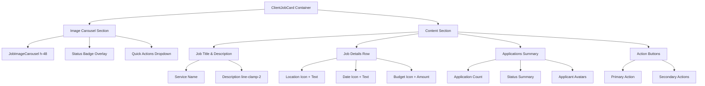

# Client Job Card Visual Alignment Plan

## Overview

Align the `ClientJobCard.vue` component with the preferred contractor job card style from `JobList.vue` while maintaining all client-specific functionality.

## Current vs Preferred Style Analysis

### Preferred Style (JobList.vue)

- **Layout**: Clean vertical layout with image carousel at top
- **Image**: Fixed height (h-48), clean carousel with indicators
- **Content**: Well-spaced content section with consistent padding
- **Hover**: Simple translateY(-2px) with subtle shadow
- **Status**: Overlay badges on image (top-right)
- **Typography**: Clean hierarchy with proper text sizes
- **Spacing**: Consistent spacing with space-y-4 pattern

### Current Style (ClientJobCard.vue)

- **Layout**: Complex vertical layout with large image header
- **Image**: Variable height (h-48 cards, h-40 list), complex overlays
- **Content**: Dense content with multiple sections
- **Hover**: Heavy effects (translateY(-2px) + complex shadows)
- **Status**: Badge overlay but with gradient backgrounds
- **Typography**: Mixed hierarchy with varying text sizes
- **Spacing**: Inconsistent padding and margins

## Alignment Strategy

### 1. Layout Restructuring



### 2. Visual Style Changes

#### Container & Card Structure

- **Before**: Complex class combinations with conditional styling
- **After**: Simple, consistent card structure matching JobList
- **Changes**:
  - Use consistent `Card` component wrapper
  - Apply `cursor-pointer` and `bg-transparent` classes
  - Remove complex border and shadow combinations
  - Use `p-0` for consistent padding approach

#### Image Section

- **Before**: Complex gradient overlays and conditional heights
- **After**: Clean image carousel with simple status overlay
- **Changes**:
  - Standardize height to `h-48` for all view modes
  - Remove gradient overlays for better image visibility
  - Move status badge to top-right corner as simple overlay
  - Keep carousel functionality but simplify styling

#### Content Section

- **Before**: Multiple nested sections with varying padding
- **After**: Single content section with consistent spacing
- **Changes**:
  - Use consistent padding pattern
  - Simplify text hierarchy
  - Organize information in clear rows
  - Maintain functionality while improving layout

#### Hover Effects

- **Before**: `translateY(-2px)` with complex shadow combinations
- **After**: Simple `translateY(-2px)` with subtle shadow
- **Changes**:
  - Simplify hover transform
  - Use consistent shadow pattern
  - Remove complex transition combinations

### 3. Component Structure Alignment

#### Template Structure

```vue
<template>
  <Card
    class="overflow-hidden cursor-pointer bg-transparent transition-colors duration-150 ease-in-out p-0 border-0"
  >
    <!-- Image Section -->
    <div class="relative">
      <JobImageCarousel :images="job.photos || []" height="h-48" />

      <!-- Status Overlay -->
      <div class="absolute top-2 right-2 flex gap-2">
        <JobStatusBadge :status="job.status" />
      </div>

      <!-- Quick Actions Dropdown -->
      <div class="absolute top-2 left-2">
        <DropdownMenu><!-- ... --></DropdownMenu>
      </div>
    </div>

    <!-- Content Section -->
    <div class="px-0 flex flex-col h-full">
      <!-- Job Title -->
      <h3 class="text-lg font-medium text-foreground mb-1 pr-4 pl-0">
        {{ job.service_name || job.category_name }}
      </h3>

      <!-- Job Description -->
      <p
        class="text-sm text-muted-foreground mb-3 line-clamp-2 flex-grow pr-4 pl-0"
      >
        {{ job.description }}
      </p>

      <!-- Job Details Row -->
      <div
        class="flex flex-wrap gap-x-3 gap-y-1 text-xs text-muted-foreground mb-3 pr-4 pl-0"
      >
        <!-- Location, Date, Budget -->
      </div>

      <!-- Applications Summary -->
      <div v-if="applications.length > 0" class="mb-3 pr-4 pl-0">
        <!-- Application stats and avatars -->
      </div>

      <!-- Action Buttons -->
      <div class="flex items-center justify-between pr-4 pl-0">
        <!-- Primary and secondary actions -->
      </div>
    </div>
  </Card>
</template>
```

### 4. Functionality Preservation

#### Maintained Features

- ✅ All existing props and emits
- ✅ Applications management
- ✅ Job editing and deletion
- ✅ Status tracking
- ✅ Quick actions dropdown
- ✅ Bulk messaging
- ✅ Image carousel with swiping
- ✅ Responsive behavior

#### Enhanced Features

- ✅ Consistent visual hierarchy
- ✅ Better accessibility
- ✅ Improved performance
- ✅ Cleaner code structure

### 5. Migration Steps

1. **Backup Current Implementation**

   - Create backup of existing ClientJobCard.vue
   - Document current functionality

2. **Apply Visual Structure Changes**

   - Update template structure to match JobList pattern
   - Simplify CSS classes and styling
   - Maintain all existing functionality

3. **Test Functionality**

   - Verify all interactions work correctly
   - Test responsive behavior
   - Validate accessibility

4. **Performance Optimization**
   - Ensure smooth animations
   - Optimize re-renders
   - Test with large datasets

### 6. Implementation Checklist

- [ ] Update card container structure
- [ ] Align image carousel styling
- [ ] Simplify status badge overlay
- [ ] Reorganize content section layout
- [ ] Standardize text hierarchy
- [ ] Implement consistent spacing
- [ ] Update hover effects
- [ ] Test all functionality
- [ ] Verify responsive design
- [ ] Validate accessibility

## Expected Outcome

The updated `ClientJobCard` will have:

- **Visual consistency** with contractor job cards
- **Maintained functionality** for all client-specific features
- **Improved user experience** with cleaner design
- **Better performance** with simplified styling
- **Enhanced maintainability** with consistent patterns

This alignment will create a unified visual language across the application while preserving the specialized functionality each user role requires.
