# Job Action Prominence & Active Job Highlighting Design Plan

## Executive Summary

This document outlines a comprehensive design solution to make job actions more prominent on the homepage and better highlight active jobs that require user attention. The primary focus is addressing the critical pain point where action buttons are too small and hidden in dropdown menus, making it difficult for users to quickly identify and take necessary actions.

## Current State Analysis

### Identified Issues

1. **Hidden Critical Actions**: Essential actions like "Start Job", "Review Work", and "Finalize Job" are buried in dropdown menus or rendered as small buttons
2. **Poor Visual Hierarchy**: Active jobs (open, assigned, in_progress) are mixed with completed jobs without clear prioritization
3. **Inadequate Action Visibility**: The `JobActionButton` component renders small buttons that don't stand out sufficiently
4. **Status Communication Problems**: Job status badges are small and positioned in corners, making job state unclear
5. **No Urgency Indicators**: Lack of clear visual treatment for jobs requiring immediate action

### Current Job Status Workflow

```
OPEN → ASSIGNED → IN_PROGRESS → COMPLETED → IN_REVIEW → FINALIZED
                                    ↓
                               CANCELLED (possible at any stage)
```

### Current Component Structure

- **BaseJobCard.vue**: Shared card layout with slot-based architecture
- **ClientJobCard.vue**: Client-specific job card with dropdown actions
- **ContractorJobCard.vue**: Contractor-specific job card
- **JobActionButton.vue**: Status-based action button component
- **ClientDashboard.vue**: Main dashboard with filtering and view management

## Design Solution Overview


## 1. Dashboard Layout Redesign

### A. Active Job Prioritization System

#### "Needs Your Attention" Section

- **Location**: Top of dashboard, above regular job listings
- **Purpose**: Highlight jobs requiring immediate user action
- **Criteria for Inclusion**:
  - Jobs with pending contractor actions (assigned status)
  - Jobs awaiting client review (completed status)
  - Jobs in review awaiting finalization
  - Urgent jobs approaching deadlines
  - Jobs with new applications (for clients)

#### Visual Hierarchy Implementation

```mermaid
graph LR
    A[🔴 Urgent Actions] --> B[🟡 Active Jobs]
    B --> C[🔵 Pending Jobs]
    C --> D[⚪ Completed Jobs]

    style A fill:#ffebee,stroke:#f44336,stroke-width:3px
    style B fill:#e8f5e8,stroke:#4caf50,stroke-width:2px
    style C fill:#fff3e0,stroke:#ff9800,stroke-width:2px
    style D fill:#f5f5f5,stroke:#9e9e9e,stroke-width:1px
```



#### Smart Sorting Algorithm

1. **Priority 1**: Jobs requiring immediate action (overdue, urgent)
2. **Priority 2**: Jobs with recent activity or updates
3. **Priority 3**: Active jobs in progress
4. **Priority 4**: Open jobs awaiting applications
5. **Priority 5**: Completed/inactive jobs

### B. Dashboard Section Structure

```
┌─────────────────────────────────────────────────────┐
│ 🚨 NEEDS YOUR ATTENTION (2 jobs)                   │
├─────────────────────────────────────────────────────┤
│ [High Priority Job Cards with Prominent Actions]   │
├─────────────────────────────────────────────────────┤
│ 📋 ACTIVE JOBS (5 jobs)                           │
├─────────────────────────────────────────────────────┤
│ [Regular Job Cards with Standard Actions]          │
├─────────────────────────────────────────────────────┤
│ ✅ COMPLETED JOBS (12 jobs)                       │
├─────────────────────────────────────────────────────┤
│ [Completed Job Cards with Minimal Actions]         │
└─────────────────────────────────────────────────────┘
```

## 2. Enhanced Job Card Design

### A. Action-First Card Layout

#### New Card Structure

```
┌─────────────────────────────────────────────────────┐
│ [Image Header with Status & Urgency Overlays]      │
├─────────────────────────────────────────────────────┤
│ Job Title & Urgency Indicators                     │
│ Description & Meta Info (Location, Date, Budget)   │
├─────────────────────────────────────────────────────┤
│ ┌─────────────────────┐ ┌─────────────────────────┐ │
│ │   PRIMARY ACTION    │ │    SECONDARY ACTIONS    │ │
│ │   (Large Button)    │ │   (Medium Buttons)      │ │
│ │                     │ │                         │ │
│ │ 🚀 START JOB        │ │ 👁️ VIEW  💬 MESSAGE     │ │
│ └─────────────────────┘ └─────────────────────────┘ │
├─────────────────────────────────────────────────────┤
│ [Progress Indicator & Next Steps]                  │
└─────────────────────────────────────────────────────┘
```

### B. Action Zone Specifications

#### Primary Action Button

- **Size**: Minimum 48px height, full width of action zone
- **Typography**: 16px font weight 600
- **Colors**: High contrast based on action type
- **States**: Default, hover, loading, disabled
- **Icons**: Prominent 20px icons with text

#### Secondary Action Buttons

- **Size**: 36px height, proportional width
- **Layout**: Horizontal row, max 3 buttons
- **Overflow**: Additional actions in dropdown menu
- **Spacing**: 8px gap between buttons

### C. Status Communication Enhancement

#### Enhanced Status Badges

- **Size**: Larger badges (minimum 24px height)
- **Position**: Top-right corner with better visibility
- **Content**: Status + next action hint
- **Examples**:
  - "ASSIGNED - Ready to Start"
  - "COMPLETED - Awaiting Review"
  - "IN REVIEW - Awaiting Approval"

#### Progress Indicators

- **Visual**: Step-based progress bar
- **Text**: Clear next-step messaging
- **Time**: Deadline and urgency indicators

## 3. Prominent Action Button System

### A. Action Button Hierarchy

#### Primary Actions (Large, Prominent)

```mermaid
stateDiagram-v2
    [*] --> Open
    Open --> Assigned: Client selects contractor
    Assigned --> InProgress: Contractor starts work
    InProgress --> Completed: Contractor completes
    Completed --> InReview: Client reviews
    InReview --> Finalized: Client finalizes

    Open: 🔵 APPLY (Contractor)<br/>📝 EDIT JOB (Client)
    Assigned: 🚀 START JOB (Contractor)<br/>👁️ VIEW PROGRESS (Client)
    InProgress: ✅ MARK COMPLETE (Contractor)<br/>💬 MESSAGE CONTRACTOR (Client)
    Completed: 🔍 REVIEW WORK (Client)<br/>⏳ AWAITING REVIEW (Contractor)
    InReview: ✨ FINALIZE JOB (Client)<br/>⏳ AWAITING APPROVAL (Contractor)
    Finalized: ✅ COMPLETED
```



#### Secondary Actions (Medium Buttons)

- View Details
- Edit Job (when applicable)
- View Applications
- Send Message
- View Contractor Profile

#### Tertiary Actions (Dropdown Menu)

- Delete Job
- Cancel Job
- Advanced Settings
- Report Issue

### B. Context-Aware Action Logic

#### For Contractors

```javascript
const getContractorActions = (job, hasApplied) => {
  switch (job.status) {
    case 'open':
      return {
        primary: hasApplied ? 'Applied' : 'Apply',
        secondary: ['View Details', 'Save Job'],
      };
    case 'assigned':
      return {
        primary: 'Start Job',
        secondary: ['View Details', 'Message Client'],
      };
    case 'in_progress':
      return {
        primary: 'Mark Complete',
        secondary: ['View Details', 'Message Client', 'Upload Progress'],
      };
    case 'completed':
      return {
        primary: 'Awaiting Review',
        secondary: ['View Details', 'Message Client'],
      };
  }
};
```

#### For Clients

```javascript
const getClientActions = (job) => {
  switch (job.status) {
    case 'open':
      return {
        primary: job.applicant_count > 0 ? 'View Applications' : 'Edit Job',
        secondary: ['View Details', 'Promote Job'],
      };
    case 'assigned':
      return {
        primary: 'View Progress',
        secondary: ['Message Contractor', 'View Details'],
      };
    case 'completed':
      return {
        primary: 'Review Work',
        secondary: ['Message Contractor', 'View Details'],
      };
        primary: 'Finalize Job',
        secondary: ['Request Changes', 'Message Contractor'],
      };
  }
};
```

## 4. Visual Design System

### A. Color-Coded Priority System

#### Action Button Colors

- **Critical Actions** (Red/Orange): `#ef4444` - Urgent actions required
- **Primary Actions** (Blue): `#3b82f6` - Main workflow actions
- **Success Actions** (Green): `#10b981` - Completion actions
- **Warning Actions** (Yellow): `#f59e0b` - Attention needed
- **Neutral Actions** (Gray): `#6b7280` - Secondary actions

#### Card Border Indicators

- **Urgent**: 3px solid red border
- **Active**: 2px solid blue border
- **Pending**: 2px solid orange border
- **Completed**: 1px solid gray border

### B. Typography Hierarchy

#### Action Button Text

- **Primary**: 16px, font-weight: 600, letter-spacing: 0.025em
- **Secondary**: 14px, font-weight: 500
- **Tertiary**: 13px, font-weight: 400

#### Status Text

- **Status Badge**: 12px, font-weight: 600, uppercase
- **Next Step**: 14px, font-weight: 500, color: primary
- **Meta Info**: 13px, font-weight: 400, color: muted

## 5. Mobile-First Responsive Design

### A. Touch-Friendly Specifications

#### Touch Targets

- **Minimum Size**: 44px × 44px (iOS/Android guidelines)
- **Recommended Size**: 48px × 48px for primary actions
- **Spacing**: Minimum 8px between touch targets

#### Mobile Layout Adaptations

```
Mobile (< 768px):
┌─────────────────────┐
│ [Image Header]      │
├─────────────────────┤
│ Title & Meta        │
├─────────────────────┤
│ ┌─────────────────┐ │
│ │ PRIMARY ACTION  │ │
│ └─────────────────┘ │
│ ┌───────┐ ┌───────┐ │
│ │ SEC 1 │ │ SEC 2 │ │
│ └───────┘ └───────┘ │
└─────────────────────┘

Tablet (768px - 1024px):
┌─────────────────────────────┐
│ [Image] │ Title & Meta      │
├─────────┼───────────────────┤
│         │ ┌───────────────┐ │
│         │ │ PRIMARY       │ │
│         │ └───────────────┘ │
│         │ ┌─────┐ ┌─────┐   │
│         │ │SEC 1│ │SEC 2│   │
│         │ └─────┘ └─────┘   │
└─────────┴───────────────────┘
```

### B. Interaction Patterns

#### Swipe Gestures

- **Swipe Right**: Quick access to primary action
- **Swipe Left**: Access to secondary actions menu
- **Long Press**: Context menu with all actions

#### Bottom Sheet Actions

- **Trigger**: Tap on "More Actions" button
- **Content**: All secondary and tertiary actions
- **Layout**: Large touch targets with icons and descriptions

## 6. Implementation Strategy

### Phase 1: Enhanced Action Button Component (Week 1-2)

#### Tasks:

1. **Redesign JobActionButton.vue**

   - Create size variants (small, medium, large)
   - Implement color-coded action types
   - Add loading and disabled states
   - Improve accessibility (ARIA labels, keyboard navigation)

2. **Create ActionButtonGroup.vue**

   - Container for primary + secondary actions
   - Responsive layout management
   - Overflow handling for mobile

3. **Update Button Design System**
   - Define button variants in design tokens
   - Create consistent spacing and typography
   - Implement hover and focus states

#### Deliverables:

- Enhanced `JobActionButton.vue` component
- New `ActionButtonGroup.vue` component
- Updated design system tokens
- Component documentation and examples

### Phase 2: Job Card Layout Improvements (Week 3-4)

#### Tasks:

1. **Modify BaseJobCard.vue**

   - Add dedicated action zone slot
   - Implement priority visual indicators
   - Enhance responsive layout system

2. **Update ClientJobCard.vue & ContractorJobCard.vue**

   - Integrate new action button system
   - Implement context-aware action logic
   - Add progress indicators and status communication

3. **Create Priority Indicators**
   - Urgency badges and borders
   - Status-based color coding
   - Next-step messaging system

#### Deliverables:

- Updated job card components
- Priority indicator system
- Responsive card layouts
- Enhanced status communication

### Phase 3: Dashboard Prioritization System (Week 5-6)

#### Tasks:

1. **Create "Needs Attention" Section**

   - Implement smart job filtering logic
   - Design priority-based sorting algorithm
   - Add section headers and counts

2. **Update ClientDashboard.vue**

   - Integrate priority sections
   - Implement smart sorting
   - Add visual hierarchy indicators

3. **Enhance Dashboard Layout**
   - Create collapsible sections
   - Add quick action shortcuts
   - Implement bulk actions for multiple jobs

#### Deliverables:

- Priority-based dashboard sections
- Smart sorting and filtering logic
- Enhanced dashboard navigation
- Bulk action capabilities

### Phase 4: Mobile Optimization & Polish (Week 7-8)

#### Tasks:

1. **Mobile-First Responsive Design**

   - Optimize touch targets and spacing
   - Implement swipe gestures
   - Create bottom sheet action menus

2. **Performance Optimization**

   - Lazy loading for job cards
   - Optimized image loading
   - Efficient state management

3. **Accessibility & Testing**
   - Screen reader compatibility
   - Keyboard navigation
   - Cross-device testing

#### Deliverables:

- Mobile-optimized components
- Gesture-based interactions
- Accessibility compliance
- Performance optimizations

## 7. Success Metrics & KPIs

### Primary Metrics

- **Action Discovery Time**: Reduce time to find actionable jobs by 50%
- **Action Completion Rate**: Increase successful action completion by 30%
- **User Engagement**: Increase daily active actions by 25%

### Secondary Metrics

- **Support Ticket Reduction**: 40% fewer job status confusion tickets
- **Mobile Usage**: 20% increase in mobile job management actions
- **User Satisfaction**: Improve job management satisfaction score by 35%

### Measurement Methods

- **Analytics Tracking**: Button click rates, time to action, completion funnels
- **User Testing**: Task completion time, error rates, satisfaction surveys
- **A/B Testing**: Compare old vs new design performance
- **Heat Mapping**: Visual interaction patterns on job cards

## 8. Technical Considerations

### A. Component Architecture

#### State Management

- Centralized action state in job store
- Optimistic UI updates for better UX
- Error handling and rollback mechanisms

#### Performance

- Virtual scrolling for large job lists
- Memoized action button rendering
- Efficient re-rendering strategies

### B. Accessibility Requirements

#### WCAG 2.1 AA Compliance

- Color contrast ratios ≥ 4.5:1
- Keyboard navigation support
- Screen reader compatibility
- Focus management

#### Inclusive Design

- High contrast mode support
- Reduced motion preferences
- Touch accommodation for motor impairments

## 9. Risk Assessment & Mitigation

### Technical Risks

- **Performance Impact**: Mitigation through lazy loading and virtualization
- **Mobile Compatibility**: Extensive cross-device testing
- **State Synchronization**: Robust error handling and retry mechanisms

### UX Risks

- **Change Resistance**: Gradual rollout with user education
- **Cognitive Overload**: Progressive disclosure and clear hierarchy
- **Accessibility Regression**: Comprehensive accessibility testing

### Business Risks

- **Development Timeline**: Phased approach with MVP delivery
- **Resource Allocation**: Clear sprint planning and milestone tracking
- **User Adoption**: Beta testing and feedback incorporation

## 10. Future Enhancements

### Advanced Features

- **AI-Powered Action Suggestions**: Smart recommendations based on job context
- **Bulk Action Management**: Multi-select and batch operations
- **Custom Action Workflows**: User-defined action sequences
- **Integration APIs**: Third-party service connections

### Analytics & Insights

- **Action Performance Dashboard**: Track action completion rates
- **User Behavior Analytics**: Understand usage patterns
- **Predictive Notifications**: Proactive action reminders

## Conclusion

This comprehensive design plan addresses the critical issue of hidden action buttons while creating a more intuitive and efficient job management experience. By prioritizing active jobs, making actions prominent, and improving visual communication, users will be able to quickly identify and complete necessary tasks.

The phased implementation approach ensures manageable development cycles while delivering incremental value. Success metrics will validate the effectiveness of the design changes and guide future improvements.

The focus on mobile-first design and accessibility ensures the solution works for all users across all devices, while the technical considerations provide a solid foundation for scalable implementation.
