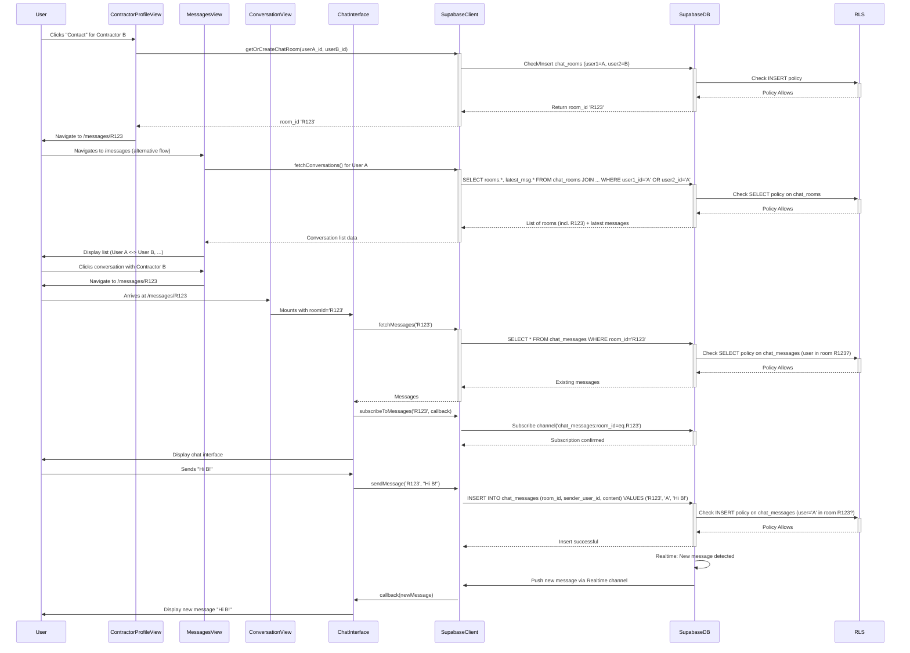

# Chat Feature Implementation Plan (Supabase Realtime)

This plan outlines the steps to implement a real-time chat feature between clients and contractors using Supabase.

**User Flow:**

- **Initiation:** A user (client) clicks a "Contact" button on a contractor's profile page.
- **Display:** A dedicated "Messages" page lists all conversations. Clicking a conversation opens it in a dedicated view.

**1. Database Schema:**

- **`chat_rooms` Table:**
  - `id` (UUID, Primary Key, default: `gen_random_uuid()`)
  - `user1_id` (UUID or TEXT, Foreign Key referencing user ID) - _Store the user ID that is lexicographically smaller._
  - `user2_id` (UUID or TEXT, Foreign Key referencing user ID) - _Store the user ID that is lexicographically larger._
  - `created_at` (Timestamp, default: `now()`)
  - _Constraint:_ Add a `UNIQUE` constraint on (`user1_id`, `user2_id`) to prevent duplicate rooms between the same two users.
  ```sql
  -- Example SQL for chat_rooms table
  CREATE TABLE public.chat_rooms (
      id uuid PRIMARY KEY DEFAULT gen_random_uuid(),
      user1_id text NOT NULL REFERENCES auth.users(id), -- Assuming Clerk user IDs are stored as text
      user2_id text NOT NULL REFERENCES auth.users(id),
      created_at timestamp with time zone DEFAULT now() NOT NULL,
      CONSTRAINT chat_rooms_user_order_check CHECK (user1_id < user2_id), -- Ensure consistent ordering
      CONSTRAINT chat_rooms_unique_users UNIQUE (user1_id, user2_id)
  );
  -- Optional: Index for faster lookups
  CREATE INDEX idx_chat_rooms_user1 ON public.chat_rooms(user1_id);
  CREATE INDEX idx_chat_rooms_user2 ON public.chat_rooms(user2_id);
  ```
- **`chat_messages` Table:**
  - `id` (UUID, Primary Key, default: `gen_random_uuid()`)
  - `room_id` (UUID, Foreign Key to `chat_rooms.id`)
  - `sender_user_id` (UUID or TEXT, Foreign Key referencing user ID)
  - `content` (TEXT, the message body)
  - `created_at` (Timestamp, default: `now()`)
  ```sql
  -- Example SQL for chat_messages table
  CREATE TABLE public.chat_messages (
      id uuid PRIMARY KEY DEFAULT gen_random_uuid(),
      room_id uuid NOT NULL REFERENCES public.chat_rooms(id) ON DELETE CASCADE,
      sender_user_id text NOT NULL REFERENCES auth.users(id),
      content text NOT NULL CHECK (char_length(content) > 0),
      created_at timestamp with time zone DEFAULT now() NOT NULL
  );
  -- Index for faster message retrieval per room
  CREATE INDEX idx_chat_messages_room_id_created_at ON public.chat_messages(room_id, created_at DESC);
  ```

**2. Enable Supabase Realtime:**

- Run SQL to add the `chat_messages` table to the `supabase_realtime` publication:
  ```sql
  -- Enable Realtime for chat_messages
  ALTER PUBLICATION supabase_realtime ADD TABLE public.chat_messages;
  ```

**3. Implement Row Level Security (RLS):**

- **Enable RLS on tables:**
  ```sql
  ALTER TABLE public.chat_rooms ENABLE ROW LEVEL SECURITY;
  ALTER TABLE public.chat_messages ENABLE ROW LEVEL SECURITY;
  ```
- **`chat_rooms` Policies:**

  ```sql
  -- Allow users to see rooms they are part of
  CREATE POLICY "Allow SELECT for room participants"
  ON public.chat_rooms
  FOR SELECT
  USING (
      auth.uid()::text = user1_id OR auth.uid()::text = user2_id
  );

  -- Allow authenticated users to create rooms (logic in function handles participant check)
  CREATE POLICY "Allow INSERT for authenticated users"
  ON public.chat_rooms
  FOR INSERT
  WITH CHECK (
      auth.role() = 'authenticated'
  );
  ```

- **`chat_messages` Policies:**

  ```sql
  -- Allow users to see messages in rooms they are part of
  CREATE POLICY "Allow SELECT for message room participants"
  ON public.chat_messages
  FOR SELECT
  USING (
      EXISTS (
          SELECT 1
          FROM public.chat_rooms cr
          WHERE cr.id = chat_messages.room_id
          AND (auth.uid()::text = cr.user1_id OR auth.uid()::text = cr.user2_id)
      )
  );

  -- Allow users to insert messages into rooms they are part of, if they are the sender
  CREATE POLICY "Allow INSERT for message room participants"
  ON public.chat_messages
  FOR INSERT
  WITH CHECK (
      auth.uid()::text = sender_user_id AND
      EXISTS (
          SELECT 1
          FROM public.chat_rooms cr
          WHERE cr.id = chat_messages.room_id
          AND (auth.uid()::text = cr.user1_id OR auth.uid()::text = cr.user2_id)
      )
  );
  ```

**4. Backend/Client Logic (Vue App - Pinia stores/composables):**

- **`getOrCreateChatRoom(otherUserId)` Function:**
  - Input: `otherUserId` (text).
  - Get current user ID: `currentUser = supabase.auth.getUser()`.
  - Determine `user1_id` (smaller ID) and `user2_id` (larger ID).
  - `supabase.from('chat_rooms').select('id').eq('user1_id', user1_id).eq('user2_id', user2_id).maybeSingle()`.
  - If exists, return `id`.
  - If not, `supabase.from('chat_rooms').insert({ user1_id, user2_id }).select('id').single()`. Return new `id`.
- **`fetchConversations()` Function:**
  - Query `chat_rooms` where current user is `user1_id` or `user2_id`.
  - Requires joining/subqueries to get the other user's details (name, avatar) and the latest message preview. This can be complex; consider a database function or view for simplification.
- **`fetchMessages(roomId)` Function:** `supabase.from('chat_messages').select('*').eq('room_id', roomId).order('created_at', { ascending: true })`.
- **`subscribeToMessages(roomId, callback)` Function:**
  ```javascript
  const channel = supabase
    .channel(`room_${roomId}`)
    .on(
      'postgres_changes',
      {
        event: 'INSERT',
        schema: 'public',
        table: 'chat_messages',
        filter: `room_id=eq.${roomId}`,
      },
      (payload) => {
        callback(payload.new); // Pass the new message object
      }
    )
    .subscribe();
  return channel; // Return channel to allow unsubscribing
  ```
- **`sendMessage(roomId, content)` Function:** `supabase.from('chat_messages').insert({ room_id: roomId, sender_user_id: currentUser.id, content: content })`.

**5. Frontend Implementation (Vue):**

- **`ContractorProfileView.vue`:**
  - Add "Contact Contractor" button.
  - `onClick`: Call `getOrCreateChatRoom(contractor.user_id)`, then `router.push({ name: 'Conversation', params: { roomId: returned_room_id } })`.
- **`MessagesView.vue` (New Component):**
  - Route: `/messages`.
  - `onMounted`: Call `fetchConversations()`.
  - Display list: `v-for="convo in conversations" :key="convo.room_id"`.
  - Link: `<router-link :to="{ name: 'Conversation', params: { roomId: convo.room_id } }">`. Show other user's name/avatar and latest message preview.
- **`ConversationView.vue` (New Component):**
  - Route: `/messages/:roomId`.
  - Props: `roomId`.
  - Contains `<ChatInterface :room-id="roomId" />`.
- **`ChatInterface.vue` (New Component):**
  - Props: `roomId`.
  - State: `messages = ref([])`, `newMessage = ref('')`, `isLoading = ref(true)`, `error = ref(null)`, `channel = null`.
  - `onMounted`:
    - Call `fetchMessages(props.roomId)` -> update `messages`, set `isLoading = false`.
    - Call `channel = subscribeToMessages(props.roomId, (newMessage) => { messages.value.push(newMessage); })`.
  - `onUnmounted`: `if (channel) supabase.removeChannel(channel)`.
  - Template: Display `messages`, input bound to `newMessage`, send button calls `handleSendMessage`.
  - `handleSendMessage`: Call `sendMessage(props.roomId, newMessage.value)`, clear `newMessage`.
- **Router (`src/router/index.js`):**
  - Add routes:
    - `{ path: '/messages', name: 'Messages', component: MessagesView, meta: { requiresAuth: true } }`
    - `{ path: '/messages/:roomId', name: 'Conversation', component: ConversationView, props: true, meta: { requiresAuth: true } }`

**Diagram:**


