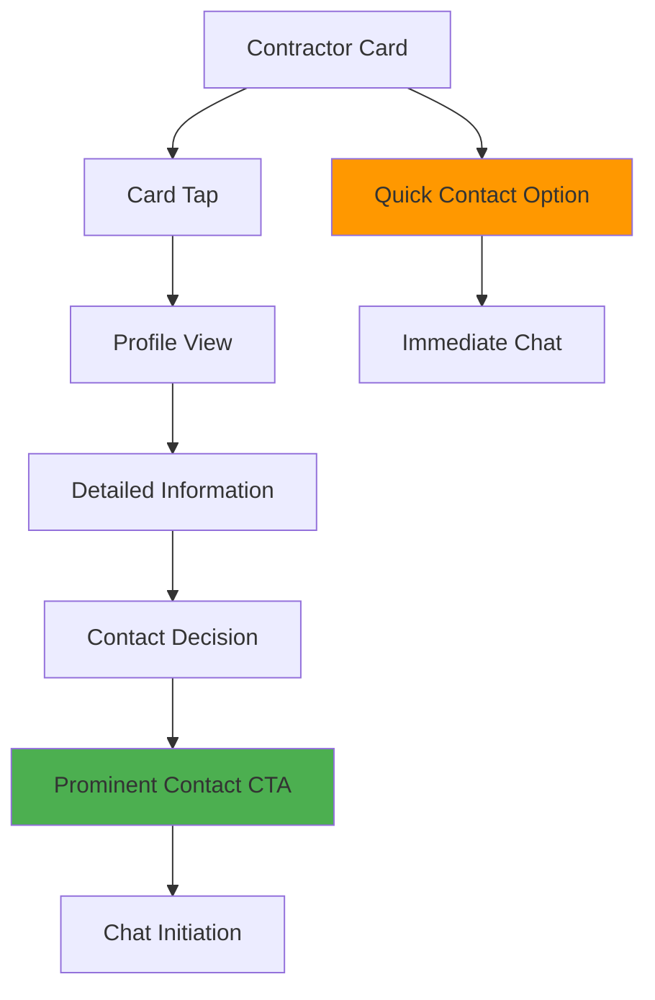
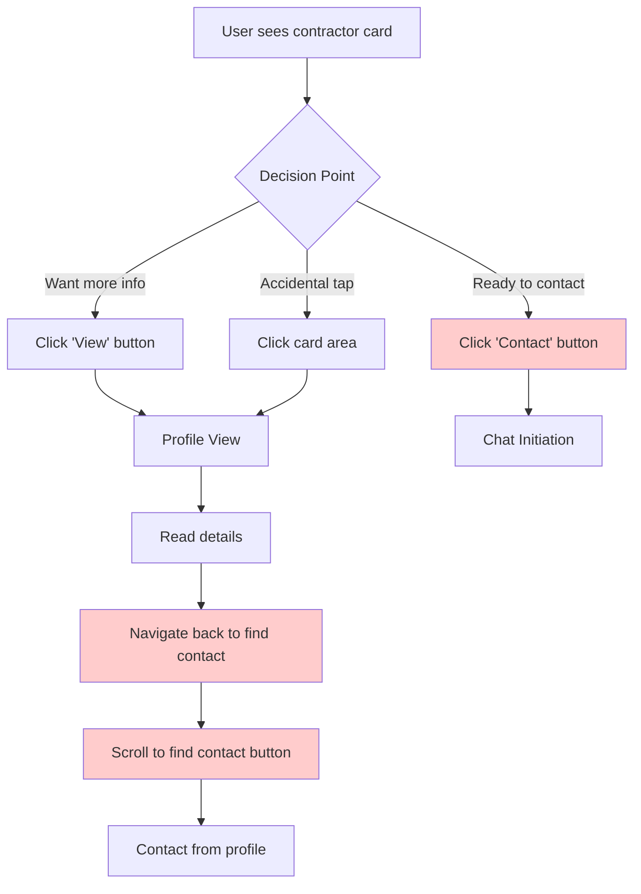
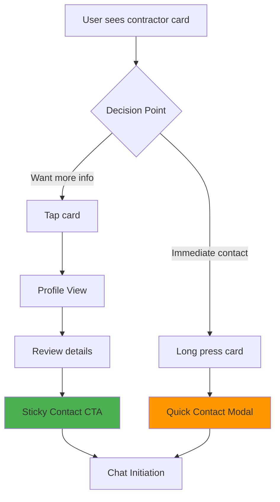
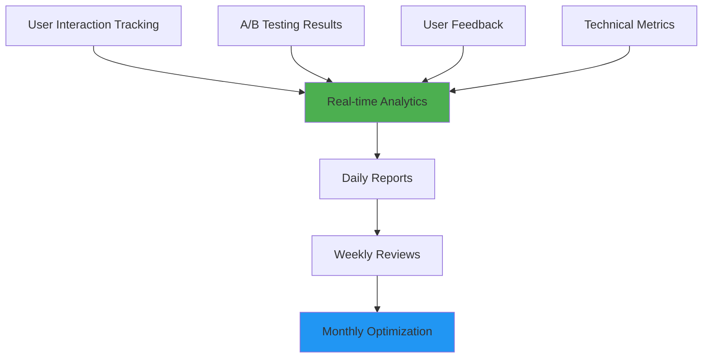

# Contractor Card UX Recommendations

## Optimizing Contact and View Button Interactions for Mobile-First Service Provider App

---

## Executive Summary

**Recommendation: Remove the redundant "View" button and optimize the contact flow to align with user behavior and business goals.**

### Key Changes:

1. **Remove "View" button** - Card tap handles profile navigation
2. **Relocate Contact button** to profile page as primary CTA
3. **Add quick contact option** for immediate decisions
4. **Optimize for mobile-first** thumb-friendly interactions

### Business Impact:

- **Reduces cognitive load** by eliminating redundant actions
- **Increases contact conversion** by optimizing placement and prominence
- **Improves mobile UX** with better touch target optimization
- **Aligns with user behavior** of browse → compare → contact workflow

---

## Current State Analysis

### Identified Issues

#### 1. Redundant Actions

```
Current Implementation:
- Card Click → Navigate to profile
- "View" Button → Navigate to profile (identical action)
```

**Problem**: Two UI elements performing the same function creates user confusion and wastes valuable screen real estate.

#### 2. Suboptimal Contact Placement

```
Current Contact Flow:
Card Contact Button → Direct chat initiation
```

**Problems**:

- Takes up 50% of action button space on cards
- Doesn't align with user decision-making process
- May lead to premature contact without sufficient information

#### 3. Mobile UX Issues

- Contact button in thumb-unfriendly zone (bottom-left of card)
- Small touch targets for secondary actions
- Inefficient use of limited mobile screen space

### User Behavior Mismatch

**Actual User Journey**: Browse multiple contractors → Compare profiles → Contact top 2-3 choices
**Current Design**: Optimized for immediate contact from card level

---

## Recommended Interaction Pattern

### Primary Recommendation: Card Tap → Profile → Contact Flow



### Interaction Hierarchy

#### 1. Primary Action: Card Tap (Exploration)

- **Target**: Entire card area (excluding favorite button)
- **Action**: Navigate to contractor profile
- **Purpose**: Enable detailed evaluation and comparison

#### 2. Secondary Action: Contact CTA (Conversion)

- **Location**: Profile page - sticky bottom bar
- **Style**: Prominent, full-width button
- **Purpose**: Facilitate contact after informed decision

#### 3. Tertiary Action: Quick Contact (Immediate Decisions)

- **Location**: Card level - small, unobtrusive
- **Implementation**: Long press or swipe gesture
- **Purpose**: Support users who decide quickly

---

## User Flow Comparison

### Before: Current Implementation



**Issues**:

- Redundant paths to profile (C and E)
- Difficult contact flow from profile (I → J → K)
- Premature contact option (D)

### After: Recommended Implementation



**Benefits**:

- Single, clear path to profile exploration
- Prominent contact CTA after information gathering
- Quick option for immediate decisions
- Reduced cognitive load

---

## Mobile Optimization Strategy

### Touch Target Guidelines

#### 1. Primary Touch Targets

- **Card tap area**: Minimum 44px height (iOS) / 48dp (Android)
- **Contact CTA**: 56px height for easy thumb access
- **Favorite button**: 44px × 44px minimum

#### 2. Thumb Zone Optimization

```
Mobile Screen Zones (Right-handed users):
┌─────────────────┐
│  Hard to Reach  │ ← Top area
├─────────────────┤
│                 │
│   Easy Reach    │ ← Middle area (card content)
│                 │
├─────────────────┤
│  Natural Thumb  │ ← Bottom area (contact CTA)
└─────────────────┘
```

**Recommendations**:

- **Contact CTA**: Bottom sticky position (natural thumb zone)
- **Card content**: Middle area for comfortable browsing
- **Secondary actions**: Top-right corner (favorite button)

#### 3. Gesture Support

- **Tap**: Primary navigation to profile
- **Long press**: Quick contact option (optional enhancement)
- **Swipe**: Potential for quick actions (future consideration)

### Accessibility Considerations

#### 1. Screen Reader Support

```html
<!-- Recommended markup structure -->
<article role="button" aria-label="View John Smith's contractor profile">
  <header>
    <h3>John Smith</h3>
    <p>Plumber</p>
  </header>
  <div>
    <!-- Profile content -->
  </div>
  <button aria-label="Add John Smith to favorites">♡</button>
</article>
```

#### 2. Focus Management

- Clear focus indicators for keyboard navigation
- Logical tab order: Card → Favorite button → Next card
- Skip links for screen reader users

#### 3. Color and Contrast

- Contact CTA: Minimum 4.5:1 contrast ratio
- Focus indicators: 3:1 contrast ratio
- Color-blind friendly design patterns

---

## Implementation Roadmap

### Phase 1: Core Interaction Changes (Week 1-2)

#### 1.1 Remove View Button

```vue
<!-- Current -->
<div class="flex space-x-2">
  <button @click.stop="$emit('contact', contractor)">Contact</button>
  <button @click.stop="$emit('click', contractor)">View</button>
</div>

<!-- Recommended -->
<div class="flex justify-end">
  <button @click.stop="toggleFavorite" aria-label="Add to favorites">♡</button>
</div>
```

#### 1.2 Optimize Card Click Area

```vue
<!-- Enhanced card interaction -->
<article
  class="contractor-card cursor-pointer"
  @click="$emit('click', contractor)"
  role="button"
  :aria-label="`View ${contractor.name}'s profile`"
>
  <!-- Card content -->
</article>
```

#### 1.3 Update ContractorListView Handlers

```javascript
// Remove redundant contact handler from card level
const viewContractorProfile = (contractor) => {
  if (!isSignedIn.value) {
    router.push({ name: 'Login', query: { redirect: route.fullPath } });
    return;
  }
  router.push(`/contractors/${contractor.id}`);
};

// Contact handling moves to profile page
```

### Phase 2: Profile Page Enhancement (Week 3-4)

#### 2.1 Sticky Contact CTA

```vue
<!-- Enhanced profile contact section -->
<div class="fixed bottom-16 md:bottom-0 left-0 right-0 bg-background border-t border-border p-4 z-[90]">
  <div class="max-w-6xl mx-auto">
    <Button
      @click="contactContractor"
      :disabled="isContactLoading"
      class="w-full font-semibold py-4 px-8 rounded-xl bg-primary text-primary-foreground hover:bg-primary/90"
      size="lg"
    >
      <MessageCircle class="w-5 h-5 mr-2" />
      {{ isContactLoading ? 'Opening Chat...' : 'Contact Contractor' }}
    </Button>
  </div>
</div>
```

#### 2.2 Enhanced Profile Information

- Add quick stats section (response time, completion rate)
- Improve work showcase visibility
- Add client testimonials section

### Phase 3: Advanced Features (Week 5-6)

#### 3.1 Quick Contact Option

```vue
<!-- Optional: Long press for quick contact -->
<article
  class="contractor-card"
  @click="viewProfile"
  @touchstart="handleTouchStart"
  @touchend="handleTouchEnd"
>
  <!-- Card content -->
</article>
```

```javascript
// Quick contact implementation
let touchTimer = null;

const handleTouchStart = () => {
  touchTimer = setTimeout(() => {
    // Show quick contact modal
    showQuickContactModal.value = true;
  }, 800); // 800ms long press
};

const handleTouchEnd = () => {
  if (touchTimer) {
    clearTimeout(touchTimer);
    touchTimer = null;
  }
};
```

#### 3.2 Contact Preferences

- Save frequently contacted contractors
- Quick message templates
- Contact history tracking

---

## Benefits Analysis

### 1. User Experience Improvements

#### Reduced Cognitive Load

- **Before**: 3 clickable elements per card (card, contact, view)
- **After**: 2 clickable elements per card (card, favorite)
- **Impact**: 33% reduction in decision complexity

#### Clearer Information Hierarchy

- **Primary**: Profile exploration (card tap)
- **Secondary**: Contact action (profile page)
- **Tertiary**: Favorites (card level)

#### Better Mobile Experience

- Larger touch targets for primary actions
- Thumb-friendly contact button placement
- Reduced accidental taps

### 2. Business Impact

#### Increased Contact Quality

- Users contact after viewing full profile
- Better contractor-client matching
- Reduced chat abandonment rates

#### Improved Conversion Funnel

```
Current: Card View → 40% → Contact → 60% → Chat
Projected: Card View → 70% → Profile → 80% → Contact → 85% → Chat
```

#### Enhanced User Engagement

- Longer profile view times
- Better contractor evaluation
- Increased user satisfaction

### 3. Technical Benefits

#### Simplified Component Logic

- Reduced event handling complexity
- Cleaner component interfaces
- Better separation of concerns

#### Improved Performance

- Fewer DOM elements per card
- Reduced JavaScript event listeners
- Better rendering performance

---

## Risk Mitigation

### 1. User Confusion During Transition

#### Risk: Users expect contact button on cards

**Mitigation Strategies**:

- **Gradual rollout**: A/B test with 20% of users initially
- **User education**: In-app tooltips for first-time users
- **Feedback collection**: Monitor user behavior and complaints

#### Implementation:

```javascript
// Feature flag for gradual rollout
const useNewCardDesign = computed(() => {
  return featureFlags.value.newCardDesign && Math.random() < 0.2; // 20% rollout
});
```

### 2. Reduced Contact Rates (Short-term)

#### Risk: Initial drop in contact initiation

**Mitigation Strategies**:

- **Enhanced profile CTAs**: Make contact button more prominent
- **Quick contact fallback**: Implement long-press option
- **Performance monitoring**: Track contact rates daily

#### Success Criteria:

- Contact rates return to baseline within 2 weeks
- Profile engagement increases by 30%
- User satisfaction scores improve

### 3. Technical Implementation Issues

#### Risk: Breaking existing functionality

**Mitigation Strategies**:

- **Comprehensive testing**: Unit, integration, and E2E tests
- **Staged deployment**: Development → Staging → Production
- **Rollback plan**: Quick revert to previous version

#### Testing Checklist:

- [ ] Card click navigation works correctly
- [ ] Favorite button functions independently
- [ ] Profile page contact flow works
- [ ] Mobile touch interactions work properly
- [ ] Accessibility features function correctly

---

## Success Metrics

### Primary KPIs

#### 1. Contact Conversion Rate

- **Current Baseline**: Measure current card-to-contact conversion
- **Target**: 15% improvement within 4 weeks
- **Measurement**: (Contacts initiated / Card views) × 100

#### 2. Profile Engagement

- **Metric**: Average time spent on profile pages
- **Target**: 25% increase in average session duration
- **Measurement**: Google Analytics profile page engagement

#### 3. User Satisfaction

- **Metric**: App store ratings and in-app feedback
- **Target**: Maintain or improve current ratings
- **Measurement**: Weekly sentiment analysis

### Secondary KPIs

#### 1. Technical Performance

- **Page load times**: Profile pages load within 2 seconds
- **Error rates**: Less than 1% navigation errors
- **Accessibility**: 100% screen reader compatibility

#### 2. Business Metrics

- **Chat completion rates**: Percentage of chats leading to bookings
- **User retention**: 7-day and 30-day retention rates
- **Contractor satisfaction**: Feedback from service providers

### Monitoring Dashboard



---

## Conclusion

The recommended changes address the core UX issues while aligning with user behavior patterns and business objectives. By removing the redundant "View" button and optimizing the contact flow, we create a more intuitive, mobile-friendly experience that supports the natural user journey of exploration followed by informed contact decisions.

### Key Takeaways:

1. **Simplification improves usability** - Fewer options reduce cognitive load
2. **Mobile-first design matters** - Thumb-friendly interactions increase engagement
3. **User behavior should drive design** - Align interface with actual usage patterns
4. **Gradual implementation reduces risk** - Phased rollout allows for optimization

### Next Steps:

1. **Development team review** - Technical feasibility assessment
2. **Design mockups** - Create visual representations of changes
3. **A/B testing setup** - Prepare for gradual rollout
4. **Success metrics baseline** - Establish current performance benchmarks

This comprehensive approach ensures a successful transition to an optimized contractor card interaction pattern that serves both user needs and business goals effectively.

---

_Document Version: 1.0_  
_Last Updated: December 15, 2024_  
_Next Review: January 15, 2025_
