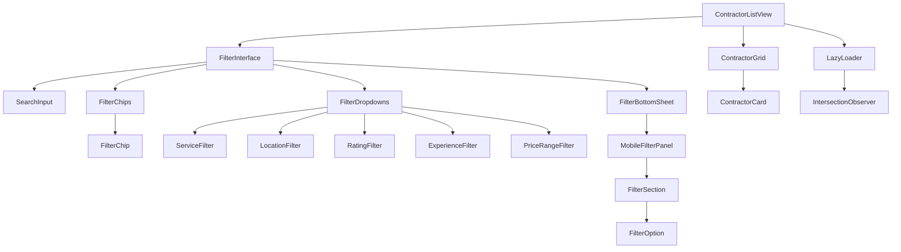
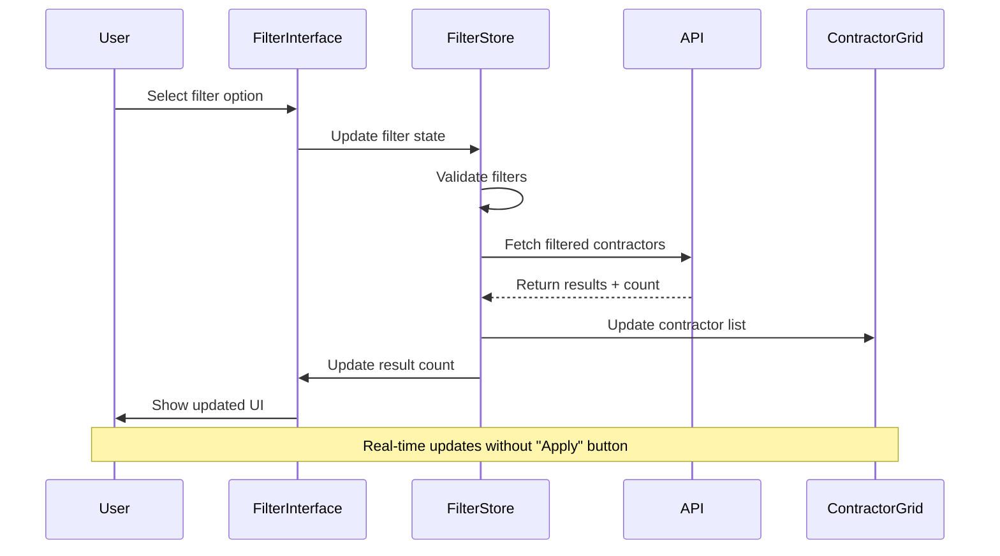

# Enhanced Contractor Filtering Interface - UI/UX Design Document

## Executive Summary

This document outlines the design specifications for an enhanced contractor filtering interface that prioritizes mobile-first design, visual appeal, and performance optimization. The solution incorporates modern UI patterns from shadcn/ui, implements lazy loading for 30+ contractors, and provides a concise yet powerful filtering experience.

## Current State Analysis

### Existing Implementation Issues

- **Modal-only filtering**: Limited mobile experience with full-screen modal
- **Basic filter options**: Only service, location, and rating filters
- **No real-time feedback**: Users must apply filters to see results
- **Performance concerns**: Loads all contractors at once
- **Limited discoverability**: Filter options hidden behind modal

### Technical Context

- **Framework**: Vue 3 with Composition API
- **UI Library**: Reka UI (shadcn/ui equivalent for Vue)
- **Styling**: Tailwind CSS with custom design tokens
- **Data Source**: Supabase with contractor_profiles table
- **Current Filters**: Service (skills), Location (district), Rating (minimum)

## Design Strategy

### 1. UI/UX Pattern Research & Recommendations

#### **Primary Pattern: Hybrid Sidebar + Chip Filters**

Based on shadcn/ui patterns and mobile-first best practices:

```
┌─────────────────────────────────────┐
│ [🔍 Search] [Filters ▼] [Sort ▼]   │
├─────────────────────────────────────┤
│ Active Filters: [Service ×] [Loc ×] │
├─────────────────────────────────────┤
│ ┌─────────┐ ┌─────────┐ ┌─────────┐ │
│ │Contractor│ │Contractor│ │Contractor│ │
│ │  Card   │ │  Card   │ │  Card   │ │
│ └─────────┘ └─────────┘ └─────────┘ │
│ ┌─────────┐ ┌─────────┐ ┌─────────┐ │
│ │Contractor│ │Contractor│ │Contractor│ │
│ │  Card   │ │  Card   │ │  Card   │ │
│ └─────────┘ └─────────┘ └─────────┘ │
│ [Load More...] (Lazy Loading)       │
└─────────────────────────────────────┘
```

#### **Alternative Patterns Evaluated**

1. **Dropdown Menus vs Multi-select Chips vs Accordion Filters**

   - **Recommendation**: Multi-select chips for active filters + dropdown for selection
   - **Rationale**: Better mobile touch targets, visual feedback, easy removal

2. **Search-with-suggestions vs Toggle buttons vs Progressive disclosure**

   - **Recommendation**: Search with suggestions + progressive disclosure
   - **Rationale**: Familiar pattern, reduces cognitive load, scalable

3. **Sidebar vs Modal vs Inline filters**

   - **Recommendation**: Hybrid approach - inline chips + bottom sheet modal on mobile
   - **Rationale**: Best of both worlds, responsive design

4. **Filter result previews and real-time updates**
   - **Recommendation**: Real-time result count + instant chip updates
   - **Rationale**: Immediate feedback, prevents empty result states

### 2. Visual Design Specifications

#### **Typography Hierarchy**

```css
/* Filter Section Headers */
.filter-section-title {
  font-family: var(--font-poppins);
  font-size: 0.875rem; /* 14px */
  font-weight: 600;
  line-height: 1.25rem;
  color: var(--foreground);
  margin-bottom: 0.5rem;
}

/* Filter Option Labels */
.filter-option-label {
  font-family: var(--font-inter);
  font-size: 0.875rem; /* 14px */
  font-weight: 400;
  line-height: 1.25rem;
  color: var(--muted-foreground);
}

/* Active Filter Chips */
.filter-chip-text {
  font-family: var(--font-inter);
  font-size: 0.75rem; /* 12px */
  font-weight: 500;
  line-height: 1rem;
  color: var(--primary-foreground);
}

/* Result Count */
.result-count {
  font-family: var(--font-inter);
  font-size: 0.875rem; /* 14px */
  font-weight: 500;
  color: var(--muted-foreground);
}
```

#### **Spacing and Layout Patterns**

```css
/* Filter Container */
.filter-container {
  padding: 1rem; /* 16px */
  gap: 1rem; /* 16px between sections */
}

/* Filter Section Spacing */
.filter-section {
  margin-bottom: 1.5rem; /* 24px */
}

/* Filter Chip Spacing */
.filter-chips {
  gap: 0.5rem; /* 8px between chips */
  margin-bottom: 1rem; /* 16px below chips */
}

/* Touch Target Minimum */
.filter-touch-target {
  min-height: 44px; /* iOS/Android minimum */
  min-width: 44px;
}
```

#### **Color Schemes for Filter States**

```css
/* Active Filter Chip */
.filter-chip-active {
  background-color: var(--primary);
  color: var(--primary-foreground);
  border: 1px solid var(--primary);
}

/* Inactive Filter Option */
.filter-option-inactive {
  background-color: var(--muted);
  color: var(--muted-foreground);
  border: 1px solid var(--border);
}

/* Hover State */
.filter-option-hover {
  background-color: var(--accent);
  color: var(--accent-foreground);
  border: 1px solid var(--accent);
}

/* Focus State */
.filter-option-focus {
  outline: 2px solid var(--ring);
  outline-offset: 2px;
}

/* Disabled State */
.filter-option-disabled {
  background-color: var(--muted);
  color: var(--muted-foreground);
  opacity: 0.5;
  cursor: not-allowed;
}
```

#### **Shadow and Elevation Patterns**

```css
/* Filter Panel Elevation */
.filter-panel {
  box-shadow:
    0 1px 3px 0 rgb(0 0 0 / 0.1),
    0 1px 2px -1px rgb(0 0 0 / 0.1);
}

/* Filter Dropdown Elevation */
.filter-dropdown {
  box-shadow:
    0 10px 15px -3px rgb(0 0 0 / 0.1),
    0 4px 6px -4px rgb(0 0 0 / 0.1);
}

/* Filter Chip Elevation */
.filter-chip {
  box-shadow: 0 1px 2px 0 rgb(0 0 0 / 0.05);
}

/* Bottom Sheet Elevation (Mobile) */
.filter-bottom-sheet {
  box-shadow:
    0 -10px 15px -3px rgb(0 0 0 / 0.1),
    0 -4px 6px -4px rgb(0 0 0 / 0.1);
}
```

#### **Animation and Transition Specifications**

```css
/* Filter Chip Animations */
.filter-chip-enter {
  animation: slideInScale 0.2s ease-out;
}

.filter-chip-exit {
  animation: slideOutScale 0.15s ease-in;
}

@keyframes slideInScale {
  from {
    opacity: 0;
    transform: scale(0.95) translateY(-4px);
  }
  to {
    opacity: 1;
    transform: scale(1) translateY(0);
  }
}

@keyframes slideOutScale {
  from {
    opacity: 1;
    transform: scale(1) translateY(0);
  }
  to {
    opacity: 0;
    transform: scale(0.95) translateY(-4px);
  }
}

/* Filter Panel Transitions */
.filter-panel-transition {
  transition: all 0.2s cubic-bezier(0.4, 0, 0.2, 1);
}

/* Bottom Sheet Animation */
.bottom-sheet-enter {
  animation: slideUpFromBottom 0.3s ease-out;
}

.bottom-sheet-exit {
  animation: slideDownToBottom 0.25s ease-in;
}

@keyframes slideUpFromBottom {
  from {
    transform: translateY(100%);
    opacity: 0;
  }
  to {
    transform: translateY(0);
    opacity: 1;
  }
}

/* Smooth result count updates */
.result-count-update {
  transition: color 0.15s ease-in-out;
}
```

### 3. Mobile-First Design Considerations

#### **Touch-Friendly Filter Controls**

- **Minimum touch targets**: 44px × 44px (iOS/Android guidelines)
- **Finger-friendly spacing**: 8px minimum between interactive elements
- **Thumb-zone optimization**: Primary actions within 75% screen height

#### **Responsive Breakpoints**

```css
/* Mobile First (320px+) */
.filter-mobile {
  /* Bottom sheet modal */
  /* Single column layout */
  /* Larger touch targets */
}

/* Tablet (768px+) */
@media (min-width: 768px) {
  .filter-tablet {
    /* Sidebar + content layout */
    /* Two-column contractor grid */
    /* Hover states enabled */
  }
}

/* Desktop (1024px+) */
@media (min-width: 1024px) {
  .filter-desktop {
    /* Persistent sidebar */
    /* Three-column contractor grid */
    /* Advanced filter options */
  }
}
```

#### **Gesture-Based Interactions**

- **Swipe to dismiss**: Filter chips and bottom sheet
- **Tap to toggle**: Filter options
- **Long-press**: Quick filter presets (future enhancement)
- **Pull to refresh**: Contractor list

#### **Collapsible Filter Sections**

```
Mobile Layout:
┌─────────────────────────────────────┐
│ [🔍 Search contractors...]         │
│ [📍 Location ▼] [⭐ Rating ▼]      │
│ Active: [Plumbing ×] [Miraflores ×] │
├─────────────────────────────────────┤
│ 📊 Showing 12 of 45 contractors    │
├─────────────────────────────────────┤
│ [Contractor Cards...]               │
└─────────────────────────────────────┘
```

### 4. Accessibility Design Requirements

#### **ARIA Labels and Roles**

```html
<!-- Filter Container -->
<div role="region" aria-label="Contractor filters">
  <!-- Filter Section -->
  <fieldset aria-labelledby="service-filter-label">
    <legend id="service-filter-label">Service Type</legend>

    <!-- Filter Options -->
    <div role="group" aria-label="Service options">
      <button
        role="option"
        aria-pressed="false"
        aria-describedby="service-plumbing-desc"
      >
        Plumbing
      </button>
    </div>
  </fieldset>

  <!-- Active Filters -->
  <div role="region" aria-label="Active filters" aria-live="polite">
    <button
      aria-label="Remove plumbing filter"
      aria-describedby="filter-removal-help"
    >
      Plumbing ×
    </button>
  </div>

  <!-- Results Count -->
  <div aria-live="polite" aria-atomic="true">Showing 12 of 45 contractors</div>
</div>
```

#### **Keyboard Navigation Patterns**

- **Tab order**: Search → Filter dropdowns → Active chips → Results
- **Arrow keys**: Navigate within filter options
- **Enter/Space**: Toggle filter selection
- **Escape**: Close filter dropdowns/modals
- **Delete/Backspace**: Remove active filter chips

#### **Color Contrast Requirements (WCAG 2.1 AA)**

```css
/* Minimum contrast ratios */
.filter-text-normal {
  /* 4.5:1 for normal text */
  color: #374151; /* Gray-700 on white */
}

.filter-text-large {
  /* 3:1 for large text (18px+) */
  color: #6b7280; /* Gray-500 on white */
}

/* High contrast mode support */
@media (prefers-contrast: high) {
  .filter-option {
    border-width: 2px;
    font-weight: 600;
  }
}
```

#### **Focus Indicators and States**

```css
/* Visible focus indicators */
.filter-focusable:focus-visible {
  outline: 2px solid var(--ring);
  outline-offset: 2px;
  border-radius: 4px;
}

/* Focus within containers */
.filter-container:focus-within {
  box-shadow: 0 0 0 2px var(--ring);
}

/* Skip to content link */
.skip-to-results {
  position: absolute;
  top: -40px;
  left: 6px;
  background: var(--primary);
  color: var(--primary-foreground);
  padding: 8px;
  text-decoration: none;
  border-radius: 4px;
  transition: top 0.3s;
}

.skip-to-results:focus {
  top: 6px;
}
```

### 5. Component Architecture Design

#### **Component Structure Diagram**



#### **State Management Architecture**

```typescript
// Filter State Interface
interface FilterState {
  // Search
  searchQuery: string;

  // Basic Filters
  services: string[];
  locations: string[];
  minRating: number | null;

  // Advanced Filters
  experienceRange: [number, number] | null;
  priceRange: [number, number] | null;
  availability: 'immediate' | 'within_week' | 'flexible' | null;

  // UI State
  isFilterPanelOpen: boolean;
  activeFilterCount: number;

  // Results
  resultCount: number;
  isLoading: boolean;
  hasMore: boolean;
}

// Filter Actions
interface FilterActions {
  // Search
  updateSearchQuery: (query: string) => void;

  // Filter Management
  addFilter: (type: FilterType, value: string) => void;
  removeFilter: (type: FilterType, value: string) => void;
  clearAllFilters: () => void;

  // UI Actions
  toggleFilterPanel: () => void;
  applyFilters: () => void;

  // Data Loading
  loadMoreContractors: () => void;
  refreshContractors: () => void;
}
```

#### **Event Handling and Data Flow**



#### **Integration Points with Existing UI Components**

```vue
<!-- Enhanced ContractorListView.vue -->
<template>
  <div class="contractor-list-container">
    <!-- Enhanced Filter Interface -->
    <FilterInterface
      v-model:filters="filterState"
      :result-count="contractors.length"
      :is-loading="isLoading"
      @filter-change="handleFilterChange"
      @search="handleSearch"
    />

    <!-- Active Filter Chips -->
    <FilterChips
      :active-filters="activeFilters"
      @remove-filter="removeFilter"
      @clear-all="clearAllFilters"
    />

    <!-- Results Summary -->
    <ResultsSummary
      :total-count="totalCount"
      :filtered-count="contractors.length"
      :is-loading="isLoading"
    />

    <!-- Contractor Grid with Lazy Loading -->
    <ContractorGrid
      :contractors="contractors"
      :is-loading="isLoading"
      @load-more="loadMoreContractors"
    />
  </div>
</template>
```

### 6. Enhanced Filter Options

#### **Comprehensive Filter Categories**

1. **Service Type** (Multi-select)

   - All available skills from contractor profiles
   - Grouped by category (Home Repair, Cleaning, Education, etc.)
   - Search within services

2. **Location** (Multi-select)

   - Lima districts from peruDistricts.js
   - Distance radius option
   - "Near me" geolocation option

3. **Rating** (Range slider)

   - Minimum rating: 3.0 - 5.0 stars
   - Show distribution histogram

4. **Experience** (Range slider)

   - Years of experience: 1-15+ years
   - Certification badges

5. **Price Range** (Range slider)

   - Estimated hourly rates
   - Budget-friendly options

6. **Availability** (Single select)

   - Immediate (today)
   - Within a week
   - Flexible scheduling

7. **Portfolio Quality** (Single select)
   - Has portfolio images
   - Verified work samples
   - Client testimonials

#### **Smart Filter Features**

```typescript
// Smart Filter Suggestions
interface SmartFilters {
  // Popular combinations
  popularCombinations: FilterCombination[];

  // Recently used
  recentFilters: FilterState[];

  // Saved presets
  savedPresets: FilterPreset[];

  // AI-powered suggestions
  suggestedFilters: FilterSuggestion[];
}

// Filter Analytics
interface FilterAnalytics {
  // Track filter usage
  trackFilterUsage: (filterType: string, value: string) => void;

  // A/B test filter layouts
  getFilterLayout: () => 'compact' | 'expanded' | 'minimal';

  // Performance metrics
  measureFilterPerformance: () => FilterMetrics;
}
```

### 7. Lazy Loading Implementation

#### **Pagination Strategy**

```typescript
interface PaginationConfig {
  initialPageSize: 30;
  subsequentPageSize: 20;
  preloadThreshold: 5; // Load more when 5 items from bottom
  maxConcurrentRequests: 2;
}

// Lazy Loading Hook
const useLazyContractors = () => {
  const contractors = ref<Contractor[]>([]);
  const isLoading = ref(false);
  const hasMore = ref(true);
  const currentPage = ref(1);

  const loadMore = async () => {
    if (isLoading.value || !hasMore.value) return;

    isLoading.value = true;
    try {
      const newContractors = await fetchContractors({
        page: currentPage.value,
        limit: currentPage.value === 1 ? 30 : 20,
        filters: filterState.value,
      });

      contractors.value.push(...newContractors);
      currentPage.value++;
      hasMore.value = newContractors.length > 0;
    } finally {
      isLoading.value = false;
    }
  };

  return { contractors, isLoading, hasMore, loadMore };
};
```

#### **Intersection Observer Implementation**

```vue
<template>
  <div class="contractor-grid">
    <ContractorCard
      v-for="contractor in contractors"
      :key="contractor.id"
      :contractor="contractor"
    />

    <!-- Loading trigger -->
    <div ref="loadingTrigger" class="loading-trigger" v-show="hasMore">
      <div v-if="isLoading" class="loading-spinner">
        Loading more contractors...
      </div>
    </div>
  </div>
</template>

<script setup>
import { ref, onMounted, onUnmounted } from 'vue';

const loadingTrigger = ref(null);
const observer = ref(null);

onMounted(() => {
  observer.value = new IntersectionObserver(
    (entries) => {
      if (entries[0].isIntersecting && hasMore.value && !isLoading.value) {
        loadMore();
      }
    },
    { threshold: 0.1 }
  );

  if (loadingTrigger.value) {
    observer.value.observe(loadingTrigger.value);
  }
});

onUnmounted(() => {
  if (observer.value) {
    observer.value.disconnect();
  }
});
</script>
```

### 8. Performance Optimizations

#### **Virtual Scrolling for Large Lists**

```typescript
// Virtual scrolling configuration
interface VirtualScrollConfig {
  itemHeight: 280; // Contractor card height
  containerHeight: 'auto';
  overscan: 5; // Render 5 extra items
  scrollThrottle: 16; // 60fps
}
```

#### **Filter Debouncing**

```typescript
// Debounced filter application
const debouncedFilterUpdate = debounce((filters: FilterState) => {
  applyFilters(filters);
}, 300);
```

#### **Optimistic UI Updates**

```typescript
// Immediate UI feedback
const addFilter = (type: FilterType, value: string) => {
  // Update UI immediately
  updateFilterChips(type, value);
  updateResultCount('calculating...');

  // Apply filter with debounce
  debouncedFilterUpdate(filterState.value);
};
```

### 9. Implementation Roadmap

#### **Phase 1: Core Filtering (Week 1-2)**

- [ ] Replace modal with inline filter interface
- [ ] Implement basic filter chips
- [ ] Add real-time result count
- [ ] Implement lazy loading with 30 initial contractors

#### **Phase 2: Enhanced Filters (Week 3-4)**

- [ ] Add experience and price range filters
- [ ] Implement search with suggestions
- [ ] Add filter presets and recent filters
- [ ] Mobile bottom sheet optimization

#### **Phase 3: Advanced Features (Week 5-6)**

- [ ] Smart filter suggestions
- [ ] Filter analytics and A/B testing
- [ ] Performance optimizations
- [ ] Accessibility audit and improvements

#### **Phase 4: Polish & Testing (Week 7-8)**

- [ ] Animation refinements
- [ ] Cross-browser testing
- [ ] Performance benchmarking
- [ ] User acceptance testing

### 10. Success Metrics

#### **User Experience Metrics**

- **Filter usage rate**: % of users who apply filters
- **Filter abandonment**: % of users who start but don't complete filtering
- **Time to find contractor**: Average time from search to contractor selection
- **Filter combination patterns**: Most popular filter combinations

#### **Performance Metrics**

- **Initial load time**: < 2 seconds for first 30 contractors
- **Filter response time**: < 300ms for filter updates
- **Lazy load performance**: < 1 second for additional pages
- **Memory usage**: Stable memory consumption during scrolling

#### **Accessibility Metrics**

- **Keyboard navigation**: 100% functionality without mouse
- **Screen reader compatibility**: Full ARIA support
- **Color contrast**: WCAG 2.1 AA compliance
- **Touch target size**: 100% compliance with 44px minimum

## Conclusion

This enhanced contractor filtering interface design prioritizes mobile-first usability, visual appeal, and performance optimization. By implementing modern UI patterns from shadcn/ui, real-time filtering feedback, and efficient lazy loading, the interface will provide a superior user experience while maintaining the existing design system consistency.

The modular component architecture ensures maintainability and extensibility, while the comprehensive accessibility features ensure inclusive design. The phased implementation approach allows for iterative improvements and user feedback incorporation throughout the development process.
