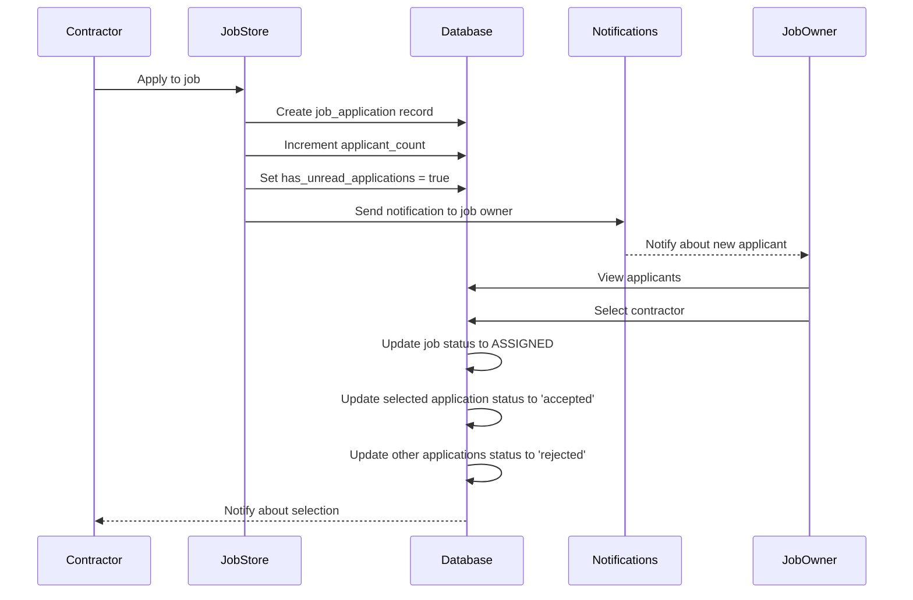
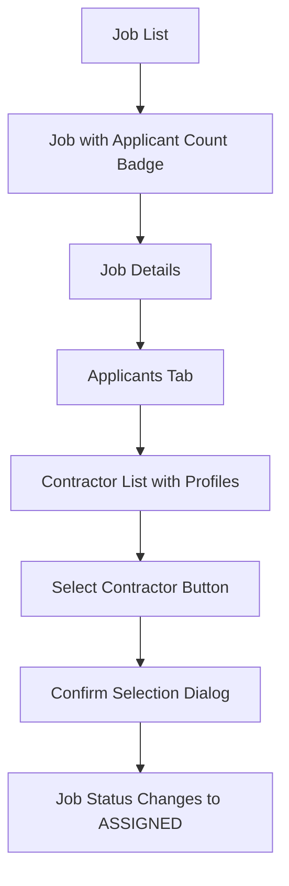
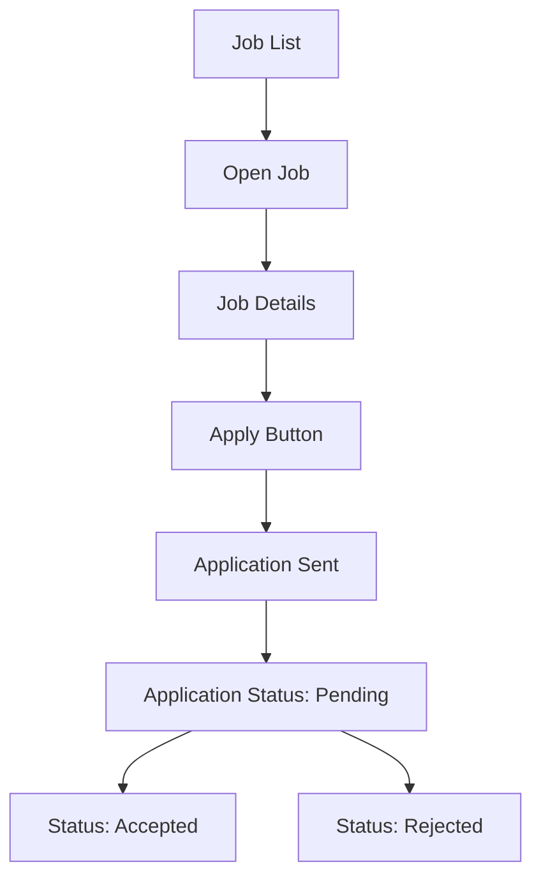

# Multi-Applicant Job System Architecture

## Overview

This document outlines the architecture for implementing a multi-applicant job system in our mobile work application. The new system will allow multiple contractors to apply for a job without immediately changing the job status, giving job owners the ability to review and select from multiple applicants.

## Current System Limitations

- When a contractor applies for a job, it immediately changes the job status from OPEN to ASSIGNED
- Only one contractor can apply for a job
- No mechanism for job owners to choose between multiple contractors
- No notification system for new applicants

## Requirements

1. When a contractor applies for a job, it should NOT change the job status immediately
2. Instead, it should send a message to the job owner that a contractor applied
3. In the client/client job overview, add a counter and notification showing contractors who applied
4. When clicking on job details, the client should see all contractors who applied and be able to select one

## 1. Database Schema Changes

We need to create a new table to track job applications and modify the existing job application flow:

```sql
-- Create job_applications table to track multiple applicants per job
CREATE TABLE public.job_applications (
    id uuid PRIMARY KEY DEFAULT gen_random_uuid(),
    job_id uuid NOT NULL REFERENCES public.job_postings(id) ON DELETE CASCADE,
    contractor_user_id text NOT NULL,
    status text NOT NULL DEFAULT 'pending', -- pending, accepted, rejected
    message text, -- Optional message from contractor
    created_at timestamp with time zone DEFAULT now() NOT NULL,
    updated_at timestamp with time zone DEFAULT now() NOT NULL,
    CONSTRAINT unique_job_contractor UNIQUE (job_id, contractor_user_id)
);

-- Create indexes for faster lookups
CREATE INDEX idx_job_applications_job_id ON public.job_applications(job_id);
CREATE INDEX idx_job_applications_contractor_user_id ON public.job_applications(contractor_user_id);

-- Add column to job_postings to track the number of applicants
ALTER TABLE public.job_postings
ADD COLUMN applicant_count integer DEFAULT 0;

-- Add column to job_postings to track if the job owner has viewed the applicants
ALTER TABLE public.job_postings
ADD COLUMN has_unread_applications boolean DEFAULT false;
```

## 2. Updated Job Application Workflow



## 3. Changes to Job Status System

The job status system remains largely the same, but we need to modify the application process:

- Keep the existing `JOB_STATUS` object unchanged
- Jobs remain in `OPEN` status until the job owner explicitly selects a contractor
- Only when a contractor is selected does the job status change to `ASSIGNED`

## 4. Notification Mechanism

We'll use the existing chat system to send notifications to job owners:

1. When a contractor applies, create a system message in the chat room between the contractor and job owner
2. If no chat room exists, create one
3. Update the job_postings table to indicate unread applications

## 5. UI Changes

### Job Owner View:



### Contractor View:



## 6. Code Changes Required

### 1. Modify `applyToJob` function in `job.js`:

```javascript
async function applyToJob(jobId, contractorUserId, message = '') {
  if (!jobId || !contractorUserId) {
    console.error('applyToJob requires jobId and contractorUserId');
    return false;
  }

  console.log(
    `Contractor ${contractorUserId} attempting to apply for job ${jobId}`
  );

  // Check if job is still open
  const currentJobData = await fetchJobById(jobId);
  if (!currentJob.value || currentJob.value.status !== JOB_STATUS.OPEN) {
    console.warn(`Job ${jobId} is no longer open.`);
    error.value = 'This job is no longer available.';
    return false;
  }

  isLoading.value = true;
  error.value = null;

  try {
    // Begin a transaction
    const { data: jobData, error: jobError } = await supabase
      .from('job_postings')
      .select('posted_by_user_id')
      .eq('id', jobId)
      .single();

    if (jobError) throw jobError;

    // Create application record
    const { error: applicationError } = await supabase
      .from('job_applications')
      .insert({
        job_id: jobId,
        contractor_user_id: contractorUserId,
        message: message,
        status: 'pending',
      });

    if (applicationError) {
      // Check if it's a unique constraint violation (already applied)
      if (applicationError.code === '23505') {
        error.value = 'You have already applied for this job.';
        return false;
      }
      throw applicationError;
    }

    // Increment applicant count and set unread flag
    const { error: updateError } = await supabase
      .from('job_postings')
      .update({
        applicant_count: currentJob.value.applicant_count + 1 || 1,
        has_unread_applications: true,
        updated_at: new Date().toISOString(),
      })
      .eq('id', jobId);

    if (updateError) throw updateError;

    // Send notification to job owner
    await sendJobApplicationNotification(
      jobId,
      contractorUserId,
      jobData.posted_by_user_id
    );

    console.log(
      `Contractor ${contractorUserId} successfully applied for job ${jobId}.`
    );

    // Refresh the current job details
    await fetchJobById(jobId);

    return true;
  } catch (err) {
    console.error(`Error applying for job ${jobId}:`, err.message);
    error.value = err.message;
    return false;
  } finally {
    isLoading.value = false;
  }
}
```

### 2. Add new function to send notifications:

```javascript
async function sendJobApplicationNotification(
  jobId,
  contractorUserId,
  jobOwnerId
) {
  try {
    // Get or create a chat room between the contractor and job owner
    const chatStore = useChatStore();
    const roomId = await chatStore.getOrCreateChatRoom(jobOwnerId);

    if (!roomId) {
      console.error('Failed to create or get chat room');
      return false;
    }

    // Send a system message about the job application
    await chatStore.sendMessage(
      roomId,
      `A contractor has applied for your job #${jobId}. View job details to see all applicants.`
    );

    return true;
  } catch (err) {
    console.error('Error sending job application notification:', err.message);
    return false;
  }
}
```

### 3. Add new function to select a contractor:

```javascript
async function selectJobContractor(jobId, contractorUserId) {
  if (!jobId || !contractorUserId) {
    console.error('selectJobContractor requires jobId and contractorUserId');
    return false;
  }

  console.log(`Selecting contractor ${contractorUserId} for job ${jobId}`);

  isLoading.value = true;
  error.value = null;

  try {
    // Begin a transaction
    const { data, error: txError } = await supabase.rpc(
      'select_job_contractor',
      {
        p_job_id: jobId,
        p_contractor_user_id: contractorUserId,
      }
    );

    if (txError) throw txError;

    console.log(
      `Contractor ${contractorUserId} successfully selected for job ${jobId}.`
    );

    // Refresh the current job details
    await fetchJobById(jobId);

    return true;
  } catch (err) {
    console.error(`Error selecting contractor for job ${jobId}:`, err.message);
    error.value = err.message;
    return false;
  } finally {
    isLoading.value = false;
  }
}
```

### 4. Create a stored procedure for selecting a contractor:

```sql
CREATE OR REPLACE FUNCTION public.select_job_contractor(
  p_job_id uuid,
  p_contractor_user_id text
) RETURNS boolean
LANGUAGE plpgsql
AS $$
BEGIN
  -- Update the selected application to 'accepted'
  UPDATE public.job_applications
  SET status = 'accepted', updated_at = now()
  WHERE job_id = p_job_id AND contractor_user_id = p_contractor_user_id;

  -- Update all other applications to 'rejected'
  UPDATE public.job_applications
  SET status = 'rejected', updated_at = now()
  WHERE job_id = p_job_id AND contractor_user_id != p_contractor_user_id;

  -- Update the job status to ASSIGNED
  UPDATE public.job_postings
  SET
    status = 'assigned',
    assigned_to_user_id = p_contractor_user_id,
    has_unread_applications = false,
    updated_at = now()
  WHERE id = p_job_id;

  RETURN true;
END;
$$;
```

### 5. Add new functions to fetch job applications:

```javascript
async function fetchJobApplications(jobId) {
  if (!jobId) {
    console.error('fetchJobApplications requires jobId');
    return [];
  }

  isLoading.value = true;
  error.value = null;

  try {
    const { data, error: fetchError } = await supabase
      .from('job_applications')
      .select(
        `
        *,
        contractor:contractor_user_id (
          user_id,
          full_name,
          avatar_url,
          rating,
          specialties
        )
      `
      )
      .eq('job_id', jobId)
      .order('created_at', { ascending: false });

    if (fetchError) throw fetchError;

    return data || [];
  } catch (err) {
    console.error(`Error fetching applications for job ${jobId}:`, err.message);
    error.value = err.message;
    return [];
  } finally {
    isLoading.value = false;
  }
}
```

## 7. UI Components Needed

1. **JobApplicantsList.vue** - A component to display all applicants for a job
2. **JobApplicantCard.vue** - A card component to display contractor information
3. **ApplicantCounter.vue** - A badge component to show the number of applicants
4. **JobApplicationForm.vue** - A form for contractors to apply with an optional message

## 8. Additional Considerations

1. **Realtime Updates**: Use Supabase's realtime functionality to update the UI when new applications are received
2. **Notifications**: Consider adding push notifications for job owners
3. **Application Expiry**: Consider adding a mechanism to expire applications after a certain period
4. **Rate Limiting**: Implement rate limiting to prevent contractors from applying to too many jobs

## Implementation Plan

1. Create the database schema changes
2. Implement the backend functions in the job store
3. Create the UI components
4. Update the JobDetailsView to include the applicants list
5. Test the system with multiple contractors
6. Deploy to production

## Conclusion

This multi-applicant job system will significantly improve the user experience for both job owners and contractors. Job owners will have more control over who they hire, and contractors will have a fair chance to apply for jobs. The system is designed to be scalable and maintainable, with clear separation of concerns between the database, backend, and frontend components.
