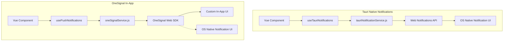
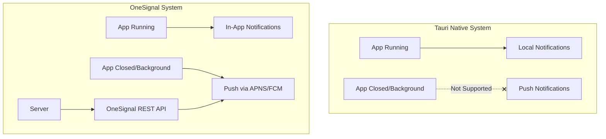
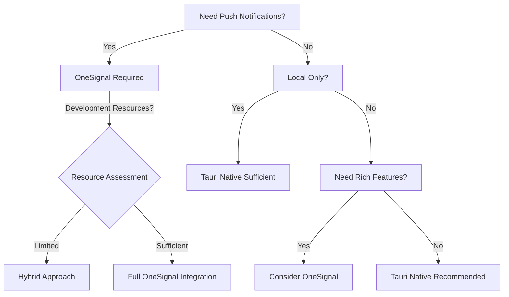

# Tauri Native Notifications vs. OneSignal for Mobile Apps: Comprehensive Comparison

## 1. Local In-App Notifications Comparison

### 1.1 Implementation Complexity & Approach



| Aspect                        | Tauri Native          | OneSignal             |
| ----------------------------- | --------------------- | --------------------- |
| **Implementation Complexity** | Low-Medium            | Medium-High           |
| **JavaScript Integration**    | Direct                | Via SDK               |
| **Configuration Required**    | Minimal               | Account setup, App ID |
| **Dependencies**              | Web Notifications API | OneSignal SDK         |

### 1.2 Feature Comparison for Local Notifications

| Feature                 | Tauri Native     | OneSignal           |
| ----------------------- | ---------------- | ------------------- |
| **Basic Notifications** | ✅ Simple        | ✅ Advanced         |
| **Rich Content**        | ❌ Limited       | ✅ Images, buttons  |
| **Custom Styling**      | ❌ OS-controlled | ✅ Customizable     |
| **Action Buttons**      | ❌ Limited       | ✅ Multiple actions |
| **Offline Support**     | ✅ Works locally | ⚠️ Requires sync    |
| **Analytics**           | ❌ None          | ✅ Comprehensive    |

### 1.3 Code Comparison

**Tauri Native (Current Implementation):**

```javascript
// From tauriNotificationService.js
async sendNotification(options) {
  try {
    // Create and show the notification using Web API
    const notification = new Notification(options.title, {
      body: options.body,
      icon: options.icon
    });

    // Handle click callback if provided
    if (typeof options.onClick === 'function') {
      notification.onclick = options.onClick;
    }

    return true;
  } catch (error) {
    console.error('Error sending notification:', error);
    throw error;
  }
}
```

**OneSignal Approach:**

```javascript
// Using OneSignal for in-app notifications
// This would be part of the oneSignalService.js
async sendInAppNotification(options) {
  // OneSignal provides more options and customization
  await OneSignal.Notifications.create({
    title: options.title,
    body: options.body,
    icon: options.icon,
    buttons: options.buttons,
    url: options.url,
    // Additional OneSignal-specific options
    imageUrl: options.imageUrl,
    actionButtons: options.actionButtons
  });
}
```

### 1.4 Ease of Use from WebView Side

**Tauri Native:**

- **Advantages**:

  - Simpler API
  - Direct integration with browser APIs
  - No external dependencies
  - Works offline without configuration

- **Disadvantages**:
  - Limited to basic notification features
  - No customization of appearance
  - No analytics or tracking

**OneSignal:**

- **Advantages**:

  - Rich notification features
  - Consistent API across platforms
  - Analytics and tracking built-in
  - More control over appearance and behavior

- **Disadvantages**:
  - Requires external service dependency
  - More complex setup and configuration
  - Requires network connectivity for full feature set

### 1.5 Recommendation for Local In-App Notifications

**Tauri Native is more appropriate when:**

- You need simple notifications triggered by app events
- You want minimal external dependencies
- Notifications are purely informational with no complex interactions
- You don't need analytics or tracking

**OneSignal offers advantages when:**

- You need rich content in notifications
- You want consistent notification appearance across platforms
- You need analytics on notification interactions
- You're already using OneSignal for push notifications

## 2. Server-Initiated Push Notifications

### 2.1 Capability Comparison



| Capability             | Tauri Native     | OneSignal             |
| ---------------------- | ---------------- | --------------------- |
| **Background Push**    | ❌ Not supported | ✅ Fully supported    |
| **Closed App Push**    | ❌ Not supported | ✅ Fully supported    |
| **Server Triggering**  | ❌ Not supported | ✅ REST API available |
| **Scheduled Delivery** | ❌ Not supported | ✅ Supported          |
| **Targeted Delivery**  | ❌ Not supported | ✅ User segmentation  |

### 2.2 Why OneSignal is Necessary for Push Notifications

The current `tauriNotificationService.js` is a web-based wrapper that can only function when:

1. The app is running
2. The WebView is active
3. JavaScript code can execute

For true push notifications that work when the app is closed or in the background, a system that integrates with platform-specific push services is required:

- **iOS**: Apple Push Notification Service (APNS)
- **Android**: Firebase Cloud Messaging (FCM)

OneSignal provides this integration, handling:

1. Device registration with APNS/FCM
2. Token management
3. Message delivery via platform channels
4. Notification display when app is not active

### 2.3 Technical Requirements Comparison

| Requirement          | Tauri Native | OneSignal                                                                  |
| -------------------- | ------------ | -------------------------------------------------------------------------- |
| **iOS Setup**        | N/A          | Apple Developer Account<br>APNS Certificates<br>Entitlements Configuration |
| **Android Setup**    | N/A          | Firebase Project<br>FCM Configuration<br>google-services.json              |
| **Server Component** | Not needed   | REST API or Dashboard                                                      |
| **Native Code**      | Not needed   | Required for both platforms                                                |

### 2.4 Implementation Complexity

**OneSignal Mobile Integration Requires:**

For iOS:

```swift
// AppDelegate modifications needed
func application(_ application: UIApplication,
                didFinishLaunchingWithOptions launchOptions: [UIApplication.LaunchOptionsKey: Any]?) -> Bool {
    // OneSignal initialization code
    OneSignal.initWithLaunchOptions(launchOptions)
    OneSignal.setAppId("YOUR_ONESIGNAL_APP_ID")

    // Additional permission handling
    return true
}
```

For Android:

```kotlin
// Application class modifications
override fun onCreate() {
    super.onCreate()

    // OneSignal Initialization
    OneSignal.initWithContext(this)
    OneSignal.setAppId("YOUR_ONESIGNAL_APP_ID")
}
```

**Tauri Plugin Development:**
A custom Tauri plugin would be needed to bridge between:

1. Native code (Swift/Kotlin)
2. Rust (Tauri core)
3. JavaScript (WebView)

This represents significant development complexity not present in the current implementation.

## 3. Overlap and Redundancy

### 3.1 Functional Overlap Analysis

```mermaid
venn
    title Notification Capabilities Overlap
    "Tauri Native" : "Local notifications when app is running"
    "OneSignal" : "Push notifications when app is closed", "Rich notifications", "Analytics", "Segmentation", "Scheduling"
    "Overlap" : "Basic notifications when app is running"
```

### 3.2 Integration Strategies

| Strategy            | Description                         | Pros                                               | Cons                                           |
| ------------------- | ----------------------------------- | -------------------------------------------------- | ---------------------------------------------- |
| **Tauri-Only**      | Use only Tauri native notifications | Simple<br>No external dependencies                 | No push when app is closed<br>Limited features |
| **OneSignal-Only**  | Use OneSignal for all notifications | Consistent API<br>Full feature set                 | External dependency<br>Higher complexity       |
| **Hybrid Approach** | Tauri for local, OneSignal for push | Best of both worlds<br>Optimized for each use case | Dual maintenance<br>Potential inconsistency    |

### 3.3 Unified API Approach

To minimize redundancy while leveraging the strengths of both systems:

```javascript
// notificationService.js - Unified API
export const notificationService = {
  // Initialize both systems
  async initialize() {
    // Initialize both systems based on capabilities
    await tauriNotificationService.initialize();
    await oneSignalService.initialize({...});
  },

  // Send a notification using the appropriate system
  async sendNotification(options) {
    // For local notifications when app is running
    if (options.local && tauriNotificationService.isSupported()) {
      return tauriNotificationService.sendNotification(options);
    }

    // For push or rich notifications
    if (oneSignalService.getState().isInitialized) {
      // Use OneSignal
      // Implementation would depend on notification type
    }
  }
}
```

## 4. Recommendations

### 4.1 Decision Framework



### 4.2 Specific Use Case Recommendations

| Use Case                        | Recommendation | Rationale                                                  |
| ------------------------------- | -------------- | ---------------------------------------------------------- |
| **Timer Completion**            | Tauri Native   | Simple local event, no need for rich features              |
| **Download Completion**         | Tauri Native   | App is already running, simple notification sufficient     |
| **New Message When App Closed** | OneSignal      | Requires push capability to notify user                    |
| **Scheduled Reminders**         | OneSignal      | Needs to trigger at specific times regardless of app state |
| **User Re-engagement**          | OneSignal      | Requires push to inactive users                            |

### 4.3 Implementation Strategy

If both systems are needed:

1. **Phase 1**: Implement Tauri native notifications for immediate in-app use cases
2. **Phase 2**: Integrate OneSignal for push notifications with custom Tauri plugin
3. **Phase 3**: Create unified notification API that selects appropriate system based on:
   - App state (running/background/closed)
   - Notification complexity (basic/rich)
   - Delivery mechanism (immediate/scheduled)

## 5. Conclusion

**Local In-App Notifications**:

- Tauri's native notification system is simpler and more appropriate for basic notifications triggered by app logic when the app is running.
- OneSignal offers richer features but with higher implementation complexity.
- If already using OneSignal for push, there are advantages to using it for local notifications as well for consistency.

**Server-Initiated Push Notifications**:

- OneSignal is necessary for this capability as Tauri's native system cannot deliver notifications when the app is closed.
- The integration with APNS/FCM is essential for mobile push notifications and is handled by OneSignal.
- Implementation requires significant native code integration and platform-specific configuration.

**Overlap and Redundancy**:

- A hybrid approach with a unified API can leverage the strengths of both systems.
- For simplicity, using OneSignal exclusively may be preferable if push notifications are required.
- The decision should be based on specific app requirements, development resources, and long-term maintenance considerations.
