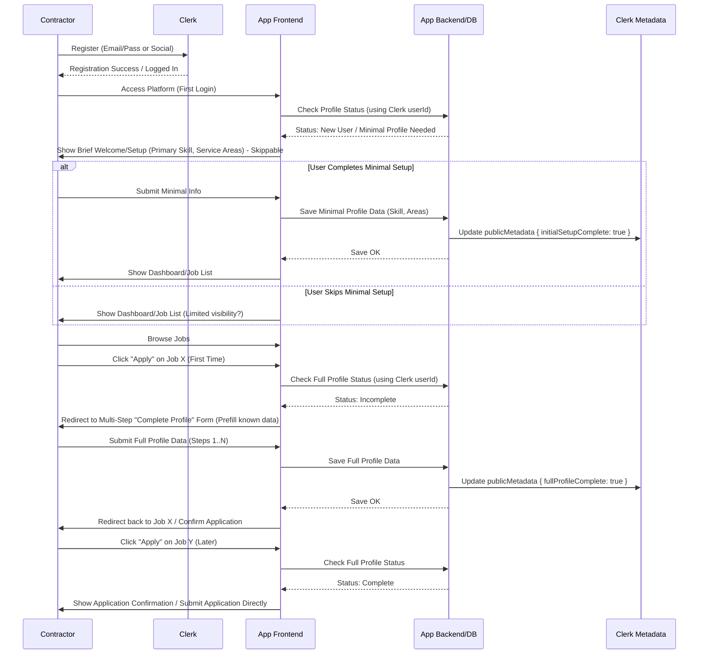

# Contractor Onboarding & Profile Completion Plan (MVP)

This document outlines the agreed-upon flow for onboarding new contractors and ensuring their profiles are sufficiently complete for the MVP.

## Goals

- Minimize friction during initial sign-up.
- Ensure essential profile data is captured before a contractor can apply for jobs.
- Maximize profile completion rates.
- Leverage Clerk for authentication and status flags, while storing detailed profile data in the application database (e.g., Supabase).

## Approved Hybrid Flow

1.  **Registration:** Contractor signs up using Clerk (Email/Password or Social Login). Basic Clerk account is created, `userId` generated.
2.  **Initial Login & Minimal Prompt:**
    - On the very first login after registration, the user is directed to a brief, _skippable_ "Welcome" step/modal.
    - This step asks for **Primary Skill** and **Service Areas** (e.g., districts covered).
    - Rationale: These are crucial for basic platform functionality (seeing relevant jobs, appearing in potential searches).
    - Data is saved to the application database, linked to the Clerk `userId`.
    - Clerk `publicMetadata` is updated (e.g., `{ initialSetupComplete: true }`).
3.  **Platform Access:** After completing or skipping the minimal prompt, the contractor gains access to the main platform features (browsing jobs, dashboard overview, etc.).
4.  **"Complete-to-Apply" Trigger:**
    - When the contractor clicks "Apply" on a job _for the first time_:
      - The system checks if their full profile is complete (e.g., by querying the DB or checking a flag like `fullProfileComplete` in Clerk metadata).
      - If the profile is _incomplete_, the application process is paused.
      - The contractor is redirected to a dedicated, multi-step "Complete Your Profile" form/wizard. Known data (e.g., from Clerk) should be prefilled.
      - Clear messaging is provided: "Please complete your profile to apply for jobs. This helps clients evaluate your application."
5.  **Profile Completion Form:**
    - Collects all remaining _essential_ data points required for the MVP (see Data Points section below).
    - Data is saved to the application database.
    - Upon successful submission of all required fields, Clerk `publicMetadata` is updated (e.g., `{ fullProfileComplete: true }`).
    - The contractor is redirected back to the job they intended to apply for, ideally resuming the application process.
6.  **Subsequent Applications:** If the system detects that `fullProfileComplete` is true, clicking "Apply" proceeds directly to the application submission/confirmation step.

## Flow Diagram (Mermaid)

## Key Data Points (MVP)

- **Collected in Minimal Prompt (Skippable):**
  - `primarySkill`: (Text Input or Select List) - _Required for basic function_
  - `serviceAreas`: (Multi-select Checkboxes/Tags for Districts/Regions) - _Required for basic function_
- **Collected in Full Profile Form (Required to Apply):**
  - `fullName`: (Text Input) - _Can prefill from Clerk_
  - `bio`: (Textarea) - _Essential for trust_
  - `yearsExperience`: (Number Input or Select) - _Builds trust_
  - `contactPhone`: (Text Input, validated) - _May be needed for coordination_
  - `profilePicture`: (File Upload) - _Highly recommended for trust_
- **Optional / Future:**
  - `secondarySkills`
  - `certificationsLicenses`
  - `portfolioUrl` / `workSamples`
- **System Generated:**
  - `averageRating`: Calculated from completed job reviews.

## Clerk Integration Notes

- Use Clerk `userId` as the foreign key to link Clerk accounts to your application's contractor profile data table.
- Prefill forms using available Clerk user data (`user.firstName`, `user.lastName`, etc.).
- Use Clerk `publicMetadata` to store boolean flags like `initialSetupComplete` and `fullProfileComplete` for quick status checks without needing a DB query solely for the flag. Avoid storing large profile data blobs in Clerk metadata.
