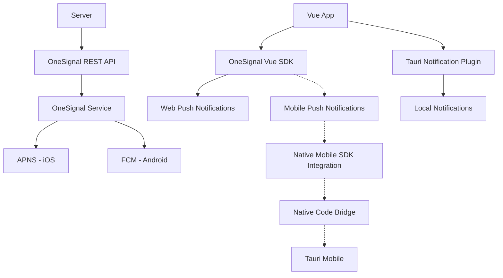
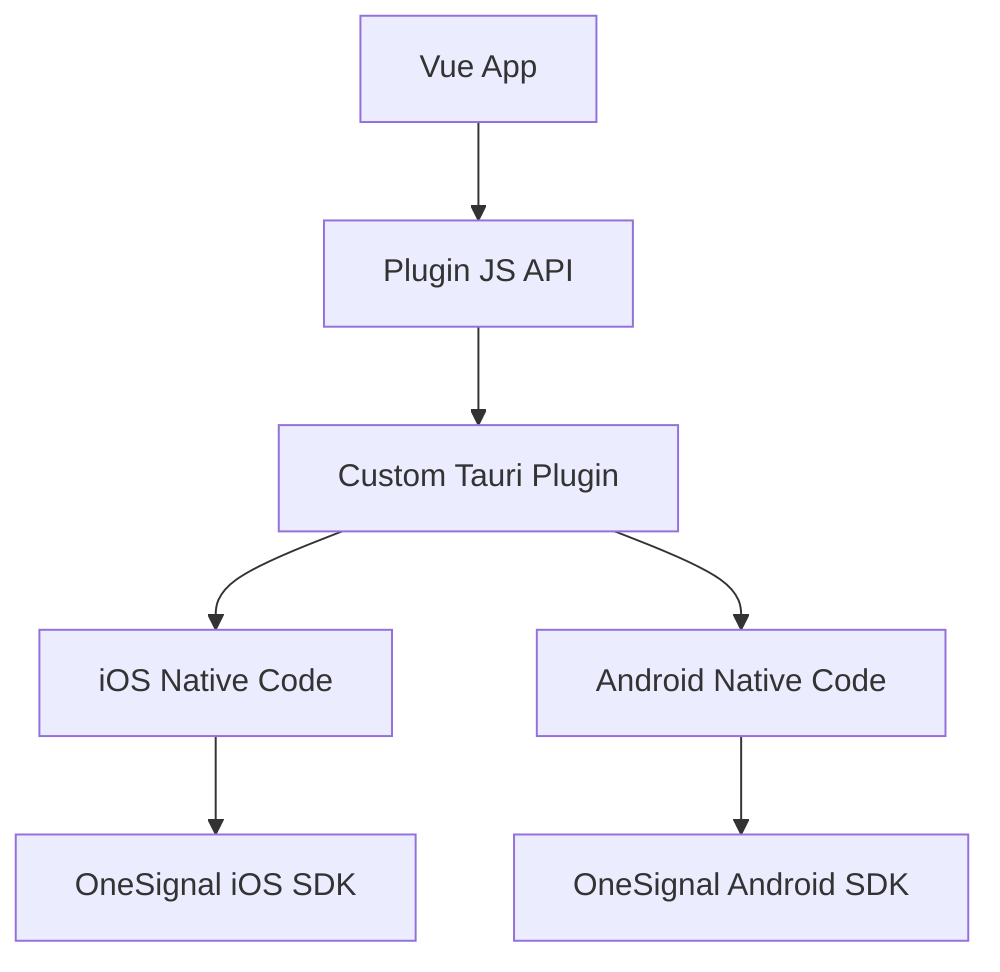
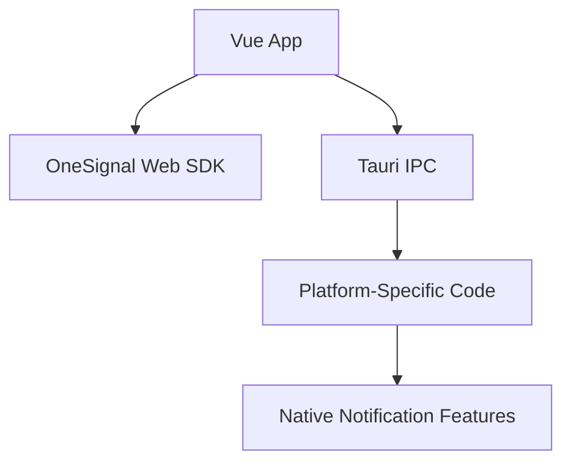
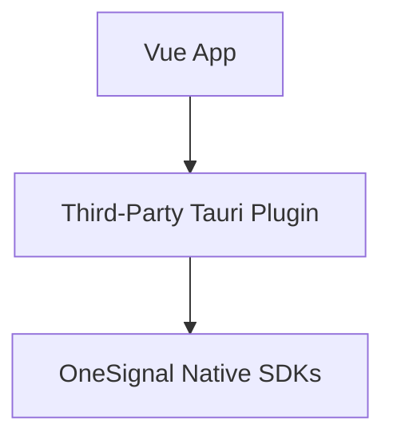
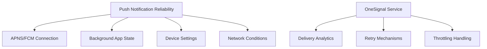
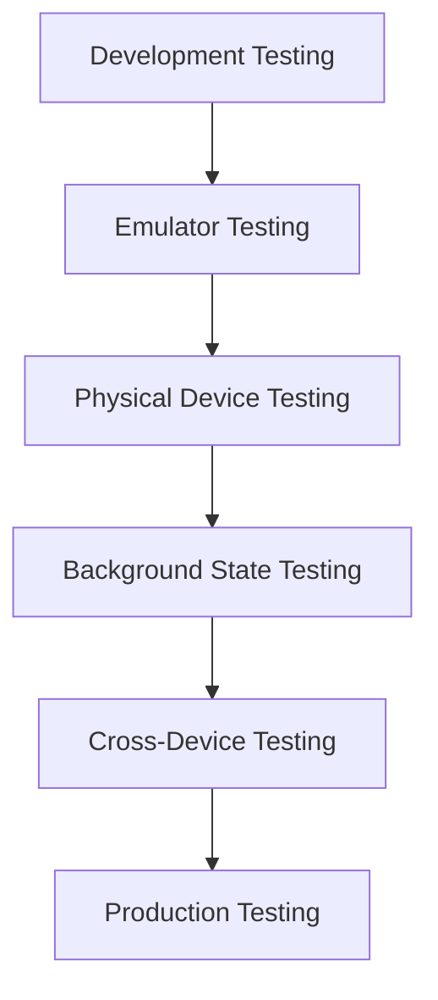

# OneSignal Evaluation for Tauri Mobile Push Notifications

## 1. Current Implementation Analysis

Your current setup includes:

- **Frontend**: Vue 3 application using `@onesignal/onesignal-vue3` (v2.2.1)
- **Tauri**: Using `tauri-plugin-notification` (v2.2.2) for native notifications
- **Dual Notification Systems**:
  - `oneSignalService.js`: Handles OneSignal web SDK integration
  - `tauriNotificationService.js`: Uses browser/Tauri native notifications

The current implementation appears to be primarily focused on web notifications, with some groundwork for mobile integration but no complete mobile-specific implementation.

## 2. Features Evaluation

### 2.1 OneSignal Mobile Push Notification Features

| Feature                      | Availability | Relevance for Tauri Mobile                               |
| ---------------------------- | ------------ | -------------------------------------------------------- |
| **Basic Push Notifications** | ✅           | Essential core functionality                             |
| **Rich Notifications**       | ✅           | Enhanced user experience with images, buttons            |
| **Segmentation**             | ✅           | Target specific user groups based on behavior/attributes |
| **Scheduling**               | ✅           | Time-based delivery, timezone-aware                      |
| **Analytics**                | ✅           | Delivery, open rates, conversion tracking                |
| **Deep Linking**             | ✅           | Direct users to specific app screens                     |
| **A/B Testing**              | ✅           | Test different notification content/strategies           |
| **Quiet Hours**              | ✅           | Respect user preferences for notification timing         |
| **Localization**             | ✅           | Multi-language support                                   |
| **Automated Messages**       | ✅           | Trigger notifications based on user behavior             |

### 2.2 Feature Implementation Complexity in Tauri Mobile

| Feature                  | Web Support | Mobile Support                 | Implementation Complexity |
| ------------------------ | ----------- | ------------------------------ | ------------------------- |
| Basic Push Notifications | ✅          | ⚠️ Requires native integration | High                      |
| Rich Notifications       | ✅          | ⚠️ Requires native integration | High                      |
| Segmentation             | ✅          | ✅                             | Low (server-side)         |
| Scheduling               | ✅          | ✅                             | Low (server-side)         |
| Analytics                | ✅          | ⚠️ Requires native integration | Medium                    |
| Deep Linking             | ✅          | ⚠️ Requires custom handling    | High                      |
| A/B Testing              | ✅          | ✅                             | Low (server-side)         |

## 3. Integration Requirements with Tauri for Mobile

### 3.1 Architecture Diagram

### 3.2 iOS Integration Requirements

1. **Apple Developer Account Setup**:

   - Enrollment in Apple Developer Program ($99/year)
   - App ID configuration with Push Notification capability

2. **Certificate/Key Configuration**:

   - Generate push notification certificate or key
   - Upload to OneSignal dashboard

3. **Xcode Project Configuration**:

   - Add Push Notification capability
   - Enable Background Modes for Remote Notifications
   - Configure Info.plist with required permissions

4. **Native Code Integration**:

   - Modify AppDelegate to handle APNS registration
   - Implement UNUserNotificationCenterDelegate
   - Add Notification Service Extension for rich notifications

5. **Tauri-Specific Requirements**:
   - Create custom plugin or modify existing notification plugin
   - Bridge between WebView and native notification handling
   - Handle permission requests through native code

### 3.3 Android Integration Requirements

1. **Firebase Setup**:

   - Create Firebase project
   - Add Android app to Firebase project
   - Download google-services.json

2. **FCM Configuration**:

   - Obtain Firebase Server Key
   - Upload to OneSignal dashboard

3. **Android Project Configuration**:

   - Modify AndroidManifest.xml with required permissions
   - Add FCM service implementation
   - Configure Gradle with required dependencies

4. **Native Code Integration**:

   - Implement FirebaseMessagingService
   - Handle token registration and message reception
   - Configure notification channels (Android 8.0+)

5. **Tauri-Specific Requirements**:
   - Create custom plugin or modify existing notification plugin
   - Bridge between WebView and native notification handling
   - Handle permission requests through native code

### 3.4 Integration Challenges

1. **Bridging Web and Native Environments**:

   - Tauri mobile apps use WebView (WKWebView on iOS, WebView on Android)
   - OneSignal's mobile capabilities require native SDK integration
   - Need to bridge between the Vue.js web context and native mobile context

2. **Native SDK Requirements**:

   - iOS: Requires AppDelegate modifications, entitlements, and certificates
   - Android: Requires manifest changes and Firebase configuration

3. **Plugin Development**:

   - May require custom Tauri plugin development to bridge OneSignal native SDKs
   - Limited documentation on Tauri mobile plugin development
   - Need to handle platform-specific code paths

4. **Current Web SDK Limitations**:
   - The `@onesignal/onesignal-vue3` package is primarily designed for web
   - Does not automatically bridge to native mobile capabilities
   - May need separate implementation paths for web vs. mobile

## 4. Implementation Options

### 4.1 Option 1: Custom Tauri Plugin

Develop a custom Tauri plugin that integrates OneSignal's native SDKs:

**Pros**:

- Full native functionality
- Complete control over integration
- Best performance and reliability

**Cons**:

- High development complexity
- Maintenance burden
- Requires native mobile development expertise

### 4.2 Option 2: Hybrid Approach

Use OneSignal's web SDK for basic functionality and supplement with platform-specific code:

**Pros**:

- Leverages existing web implementation
- Incremental approach
- Easier to maintain

**Cons**:

- Limited functionality
- Potential reliability issues
- May not support all OneSignal features

### 4.3 Option 3: Third-Party Plugin

Look for existing Tauri plugins that might already bridge to OneSignal:

**Pros**:

- Reduced development effort
- Potentially maintained by community
- Faster implementation

**Cons**:

- May not exist or be mature
- Less control over implementation
- Potential compatibility issues

## 5. Reliability and Delivery Assessment

### 5.1 Delivery Reliability Factors

### 5.2 Platform-Specific Considerations

| Platform | Delivery Mechanism | Background Limitations                                              | Implementation Complexity |
| -------- | ------------------ | ------------------------------------------------------------------- | ------------------------- |
| iOS      | APNS               | Strict background restrictions, no true background processing       | High                      |
| Android  | FCM                | More permissive, but manufacturer variations (esp. Chinese devices) | Medium-High               |

### 5.3 OneSignal Reliability Assessment

- **APNS Integration**: OneSignal maintains reliable connection to Apple's push notification service
- **FCM Integration**: Well-established integration with Firebase Cloud Messaging
- **Delivery Rates**: Generally high (95%+) but dependent on device settings and network
- **Background Delivery**: Reliable when app is in background or closed
- **Throttling Handling**: Manages rate limits imposed by APNS and FCM
- **Retry Logic**: Implements exponential backoff for failed deliveries

## 6. Limitations for Mobile in Tauri Context

### 6.1 Technical Limitations

1. **Native Bridge Complexity**:

   - Tauri's mobile support is relatively new
   - Limited documentation for native plugin development
   - Potential performance overhead in WebView-to-native communication

2. **Platform Restrictions**:

   - iOS: Strict background execution limitations
   - Android: Varying behavior across manufacturers, especially Chinese devices

3. **SDK Integration Challenges**:
   - OneSignal SDK updates may require plugin updates
   - Potential version compatibility issues
   - Need to maintain separate code paths for iOS and Android

### 6.2 Feature Limitations

1. **Rich Notifications**:

   - May require additional native extensions
   - Media attachments need special handling

2. **Action Buttons**:

   - Require custom handling to bridge back to WebView
   - Platform-specific implementation differences

3. **Deep Linking**:
   - Custom scheme handling needed
   - Requires coordination between native and web layers

### 6.3 Development and Maintenance Overhead

1. **Dual Expertise Required**:

   - Web development (Vue.js)
   - Native mobile development (Swift/Kotlin)
   - Tauri plugin development (Rust)

2. **Testing Complexity**:

   - Need to test on multiple physical devices
   - Emulator limitations for push testing
   - Background state testing challenges

3. **Update Management**:
   - OneSignal SDK updates
   - Tauri framework updates
   - iOS/Android platform updates

## 7. Testing Strategy

## 8. Recommendations and Next Steps

### 8.1 Recommended Approach

Based on the analysis, the recommended approach is a **phased implementation**:

1. **Phase 1: Prototype with Custom Plugin**

   - Develop minimal custom Tauri plugin for OneSignal
   - Focus on basic notification delivery
   - Test on both iOS and Android

2. **Phase 2: Feature Expansion**

   - Add rich notifications
   - Implement deep linking
   - Add analytics integration

3. **Phase 3: Production Hardening**
   - Comprehensive testing
   - Performance optimization
   - Documentation and maintenance plan

### 8.2 Next Steps

1. **Technical Spike**:

   - Create minimal Tauri mobile app with OneSignal integration
   - Test on both iOS and Android platforms
   - Evaluate development complexity

2. **Documentation Review**:

   - Deep dive into OneSignal's mobile SDK documentation
   - Review Tauri's plugin development guidelines
   - Identify potential integration points

3. **Community Engagement**:

   - Engage with Tauri community about mobile push notification solutions
   - Check if others have successfully integrated OneSignal
   - Explore potential for collaboration

4. **Decision Point**:
   - Evaluate findings from spike and research
   - Decide on implementation approach
   - Create detailed implementation plan
