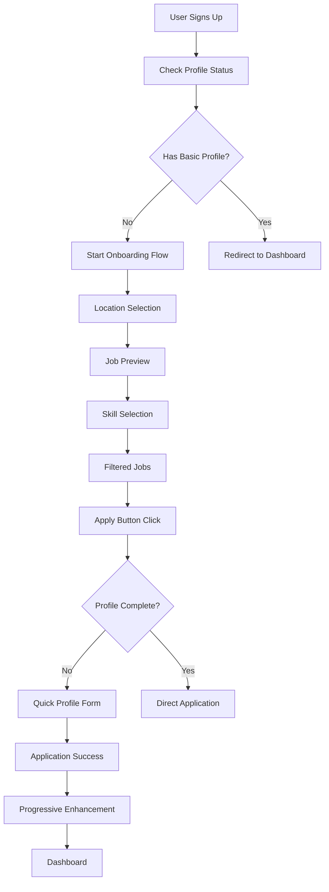

# Optimized Contractor Onboarding Flow - Complete Design Specification

## Executive Summary

This document provides comprehensive wireframes, component specifications, and technical implementation details for the optimized contractor onboarding flow. The design follows a "Value First, Progressive Disclosure" approach that shows available jobs within 30 seconds of signup while strategically collecting data just-in-time.

## Design Principles

1. **Value First**: Show jobs before asking for personal information
2. **Progressive Disclosure**: Collect data when it's needed, not upfront
3. **Mobile-First**: Touch-optimized interactions and thumb-friendly navigation
4. **Just-in-Time**: Profile completion triggered by application attempts
5. **Gamification**: Credits and progress indicators to encourage completion

## Complete Screen Flow

### Screen 1: ValueFirstWelcome.vue

```
┌─────────────────────────────────────┐
│ ← [Skip]                    [1/6] ● │ ← Progress indicator
├─────────────────────────────────────┤
│                                     │
│         🏠                          │ ← Large, friendly icon
│    Welcome to WorkApp               │ ← App name/brand
│                                     │
│  Find skilled work opportunities    │ ← Value proposition
│     in your neighborhood            │
│                                     │
│ ┌─────────────────────────────────┐ │
│ │ 📍 Detect My Location           │ │ ← Primary action
│ │ [GPS icon] Auto-detect          │ │
│ └─────────────────────────────────┘ │
│                                     │
│ ┌─────────────────────────────────┐ │
│ │ 🗺️ Choose My District          │ │ ← Secondary action
│ │ [Dropdown icon] Manual select   │ │
│ └─────────────────────────────────┘ │
│                                     │
│ ┌─────────────────────────────────┐ │
│ │        Continue                 │ │ ← CTA button
│ └─────────────────────────────────┘ │
│                                     │
│ [Skip for now]                      │ ← Skip option
└─────────────────────────────────────┘
```

### Screen 2: JobPreview.vue

```
┌─────────────────────────────────────┐
│ ← [Back]                    [2/6] ● │
├─────────────────────────────────────┤
│                                     │
│ 🎯 Jobs Available in Miraflores    │ ← Location-specific title
│                                     │
│ ┌─────────────────────────────────┐ │
│ │ 🔨 Plumbing                     │ │ ← Job category cards
│ │ 12 jobs • S/150-200/day         │ │
│ │ [View Jobs →]                   │ │
│ └─────────────────────────────────┘ │
│                                     │
│ ┌─────────────────────────────────┐ │
│ │ ⚡ Electrical                   │ │
│ │ 8 jobs • S/180-250/day          │ │
│ │ [View Jobs →]                   │ │
│ └─────────────────────────────────┘ │
│                                     │
│ ┌─────────────────────────────────┐ │
│ │ 🎨 Painting                     │ │
│ │ 15 jobs • S/120-180/day         │ │
│ │ [View Jobs →]                   │ │
│ └─────────────────────────────────┘ │
│                                     │
│ ┌─────────────────────────────────┐ │
│ │ 🪚 Carpentry                    │ │
│ │ 6 jobs • S/160-220/day          │ │
│ │ [View Jobs →]                   │ │
│ └─────────────────────────────────┘ │
│                                     │
│ ┌─────────────────────────────────┐ │
│ │        Get Started              │ │ ← Primary CTA
│ └─────────────────────────────────┘ │
│                                     │
│ [See All Categories]                │ ← Secondary action
└─────────────────────────────────────┘
```

### Screen 3: SkillInterestSelector.vue

```
┌─────────────────────────────────────┐
│ ← [Back]                    [3/6] ● │
├─────────────────────────────────────┤
│                                     │
│    What type of work interests      │ ← Question format
│           you most?                 │
│                                     │
│ ┌───────────────┬─────────────────┐ │
│ │   🔨          │       ⚡        │ │ ← 2-column grid
│ │ Plumbing      │   Electrical    │ │
│ │ 12 jobs       │    8 jobs       │ │
│ └───────────────┴─────────────────┘ │
│                                     │
│ ┌───────────────┬─────────────────┐ │
│ │   🎨          │       🪚        │ │
│ │ Painting      │   Carpentry     │ │
│ │ 15 jobs       │    6 jobs       │ │
│ └───────────────┴─────────────────┘ │
│                                     │
│ ┌───────────────┬─────────────────┐ │
│ │   🌱          │       🔧        │ │
│ │ Gardening     │    General      │ │
│ │ 4 jobs        │   10 jobs       │ │
│ └───────────────┴─────────────────┘ │
│                                     │
│ ✨ You can add more skills later    │ ← Reassurance
│                                     │
│ ┌─────────────────────────────────┐ │
│ │        Continue                 │ │ ← Enabled when selected
│ └─────────────────────────────────┘ │
│                                     │
│ [I'm not sure yet]                  │ ← Skip option
└─────────────────────────────────────┘
```

### Screen 4: FilteredJobList.vue

```
┌─────────────────────────────────────┐
│ ← [Back]                    [4/6] ● │
├─────────────────────────────────────┤
│                                     │
│ 🔨 Plumbing Jobs Near You          │ ← Personalized title
│                                     │
│ ┌─────────────────────────────────┐ │
│ │ 💧 Fix Kitchen Sink             │ │ ← Job cards
│ │ Miraflores • S/150              │ │
│ │ Posted 2 hours ago              │ │
│ │ [Apply Now]                     │ │
│ └─────────────────────────────────┘ │
│                                     │
│ ┌─────────────────────────────────┐ │
│ │ 🚿 Bathroom Renovation          │ │
│ │ San Isidro • S/800              │ │
│ │ Posted 1 day ago                │ │
│ │ [Apply Now]                     │ │
│ └─────────────────────────────────┘ │
│                                     │
│ ┌─────────────────────────────────┐ │
│ │ 🔧 Emergency Pipe Repair        │ │
│ │ Surco • S/120                   │ │
│ │ Posted 3 hours ago              │ │
│ │ [Apply Now]                     │ │
│ └─────────────────────────────────┘ │
│                                     │
│ [See More Jobs]                     │ ← Load more
│                                     │
│ ┌─────────────────────────────────┐ │
│ │ 👤 Complete profile to apply    │ │ ← Profile prompt
│ └─────────────────────────────────┘ │
└─────────────────────────────────────┘
```

### Screen 5: QuickProfileForm.vue (Just-in-Time)

```
┌─────────────────────────────────────┐
│ ← [Back]                    [5/6] ● │
├─────────────────────────────────────┤
│                                     │
│    Almost there! Complete to        │ ← Urgency + benefit
│         apply for this job          │
│                                     │
│ ┌─────────────────────────────────┐ │
│ │ 💧 Fix Kitchen Sink             │ │ ← Job reminder
│ │ S/150 • Miraflores              │ │
│ └─────────────────────────────────┘ │
│                                     │
│ 👤 Full Name                        │ ← Essential fields only
│ [________________]                  │
│                                     │
│ 📱 Phone Number                     │
│ [+51 ___________]                   │
│                                     │
│ 💼 Years of Experience              │
│ [○ 0-1] [●3-5] [○ 5-10] [○ 10+]    │ ← Radio buttons
│                                     │
│ ┌─────────────────────────────────┐ │
│ │     Complete & Apply            │ │ ← Primary action
│ └─────────────────────────────────┘ │
│                                     │
│ [Save for Later]                    │ ← Secondary option
│                                     │
│ 🔒 Your information is secure       │ ← Trust indicator
└─────────────────────────────────────┘
```

### Screen 6: ApplicationSuccess.vue

```
┌─────────────────────────────────────┐
│                             [6/6] ● │
├─────────────────────────────────────┤
│                                     │
│              ✅                     │ ← Success icon
│                                     │
│        Application Submitted!       │ ← Success message
│                                     │
│ ┌─────────────────────────────────┐ │
│ │ 💧 Fix Kitchen Sink             │ │ ← Applied job
│ │ Application sent to Maria C.    │ │
│ │ Expected response: 2-4 hours    │ │
│ └─────────────────────────────────┘ │
│                                     │
│ ┌─────────────────────────────────┐ │
│ │ 🎯 Boost your chances by 3x     │ │ ← Profile enhancement
│ │ Add a profile photo and bio     │ │
│ │                                 │ │
│ │ ⭐ +50 credits for completion   │ │ ← Incentive
│ │                                 │ │
│ │ [Add Photo & Bio]               │ │
│ └─────────────────────────────────┘ │
│                                     │
│ ┌─────────────────────────────────┐ │
│ │ 📱 Get notified instantly       │ │ ← Notification prompt
│ │ Enable push notifications       │ │
│ │ [Enable Notifications]          │ │
│ └─────────────────────────────────┘ │
│                                     │
│ [Continue to Dashboard]             │ ← Primary action
│                                     │
│ [Maybe Later]                       │ ← Skip option
└─────────────────────────────────────┘
```

## Technical Implementation Plan

### Component Architecture

**New Components to Create:**

```
src/components/onboarding/
├── ValueFirstWelcome.vue
├── JobPreview.vue
├── SkillInterestSelector.vue
├── FilteredJobList.vue
├── QuickProfileForm.vue
├── ApplicationSuccess.vue
├── ProfileBoostPrompt.vue
├── NotificationPermissionPrompt.vue
├── ProgressIndicator.vue
├── LocationOption.vue
├── JobCategoryCard.vue
├── SkillCard.vue
└── ExperienceOption.vue
```

**Main Flow Controller:**

```
src/views/OnboardingFlow.vue
```

### Router Configuration

```javascript
// src/router/index.js - Add new routes
{
  path: '/onboarding',
  name: 'Onboarding',
  component: () => import('../views/OnboardingFlow.vue'),
  meta: {
    requiresAuth: true,
    newUsersOnly: true,
    roles: ['contractor']
  }
},
{
  path: '/onboarding/jobs-preview',
  name: 'JobsPreview',
  component: () => import('../components/onboarding/JobPreview.vue'),
  meta: { requiresAuth: false }
}
```

### Data Flow Architecture



### Database Schema Updates

```sql
-- Add onboarding tracking
ALTER TABLE contractor_profiles ADD COLUMN onboarding_completed_at TIMESTAMP;
ALTER TABLE contractor_profiles ADD COLUMN onboarding_step VARCHAR(50);
ALTER TABLE contractor_profiles ADD COLUMN profile_completion_percentage INTEGER DEFAULT 0;

-- Add credits system
CREATE TABLE contractor_credits (
  id UUID PRIMARY KEY DEFAULT gen_random_uuid(),
  contractor_id UUID REFERENCES contractor_profiles(id),
  credits INTEGER DEFAULT 0,
  earned_from VARCHAR(100),
  earned_at TIMESTAMP DEFAULT NOW()
);

-- Add onboarding analytics
CREATE TABLE onboarding_analytics (
  id UUID PRIMARY KEY DEFAULT gen_random_uuid(),
  user_id UUID,
  event_name VARCHAR(100),
  event_data JSONB,
  created_at TIMESTAMP DEFAULT NOW()
);
```

### State Management

```javascript
// src/stores/onboarding.js
import { defineStore } from 'pinia';

export const useOnboardingStore = defineStore('onboarding', {
  state: () => ({
    currentStep: 'welcome',
    onboardingData: {
      location: null,
      locationMethod: null,
      selectedSkill: null,
      viewedJobs: [],
      startTime: null,
    },
    selectedJob: null,
    profileData: null,
  }),

  actions: {
    startOnboarding() {
      this.onboardingData.startTime = Date.now();
      this.trackEvent('onboarding_started');
    },

    setLocation(location, method) {
      this.onboardingData.location = location;
      this.onboardingData.locationMethod = method;
      this.trackEvent('location_selected', { location, method });
    },

    setSkill(skill) {
      this.onboardingData.selectedSkill = skill;
      this.trackEvent('skill_selected', { skill });
    },

    trackJobView(jobId) {
      this.onboardingData.viewedJobs.push(jobId);
      this.trackEvent('job_viewed', { jobId });
    },

    async trackEvent(eventName, data = {}) {
      // Send to analytics
      await fetch('/api/analytics/onboarding', {
        method: 'POST',
        headers: { 'Content-Type': 'application/json' },
        body: JSON.stringify({
          event: eventName,
          data: { ...data, ...this.onboardingData },
          timestamp: new Date().toISOString(),
        }),
      });
    },
  },
});
```

### API Endpoints

```javascript
// src/api/onboarding.js
export const onboardingAPI = {
  async getJobStats(location) {
    const { data } = await supabase
      .from('jobs')
      .select('service_type, budget_min, budget_max')
      .eq('location', location)
      .eq('status', 'open');

    return this.aggregateJobStats(data);
  },

  async getFilteredJobs(skill, location, limit = 10) {
    const { data } = await supabase
      .from('jobs')
      .select('*')
      .eq('service_type', skill)
      .eq('location', location)
      .eq('status', 'open')
      .order('created_at', { ascending: false })
      .limit(limit);

    return data;
  },

  async saveQuickProfile(profileData) {
    const { data, error } = await supabase.from('contractor_profiles').upsert({
      ...profileData,
      profile_completion_percentage: 40,
      updated_at: new Date().toISOString(),
    });

    if (error) throw error;
    return data;
  },

  async submitJobApplication(jobId, contractorId) {
    const { data, error } = await supabase.from('job_applications').insert({
      job_id: jobId,
      contractor_id: contractorId,
      status: 'pending',
      applied_at: new Date().toISOString(),
    });

    if (error) throw error;
    return data;
  },
};
```

### Progressive Enhancement System

```javascript
// src/composables/useProfileEnhancement.js
export function useProfileEnhancement() {
  const { user, getSupabaseClient } = useAuth();
  const supabase = getSupabaseClient();

  const enhancementPrompts = ref([
    {
      id: 'photo',
      title: 'Add Profile Photo',
      description: 'Contractors with photos get 3x more responses',
      credits: 25,
      trigger: 'after_first_application',
      priority: 1,
    },
    {
      id: 'bio',
      title: 'Write Professional Bio',
      description: 'Tell clients about your experience',
      credits: 25,
      trigger: 'after_first_application',
      priority: 2,
    },
    {
      id: 'portfolio',
      title: 'Add Work Samples',
      description: 'Show your best work',
      credits: 50,
      trigger: 'after_first_job',
      priority: 3,
    },
  ]);

  const getNextPrompt = async (trigger) => {
    const profile = await getCurrentProfile();
    return enhancementPrompts.value.find(
      (prompt) => prompt.trigger === trigger && !profile[prompt.id]
    );
  };

  const completeEnhancement = async (enhancementId, data) => {
    // Update profile
    await supabase
      .from('contractor_profiles')
      .update({
        [enhancementId]: data,
        profile_completion_percentage: calculateCompletion(),
      })
      .eq('user_id', user.value.id);

    // Award credits
    await awardCredits(
      enhancementPrompts.value.find((p) => p.id === enhancementId).credits
    );
  };

  return {
    enhancementPrompts,
    getNextPrompt,
    completeEnhancement,
  };
}
```

### A/B Testing Framework

```javascript
// src/composables/useABTesting.js
export function useABTesting() {
  const experiments = ref({
    onboarding_flow: {
      variants: ['current', 'value_first'],
      weights: [50, 50],
    },
    profile_collection: {
      variants: ['upfront', 'just_in_time'],
      weights: [30, 70],
    },
  });

  const getVariant = (experimentName) => {
    const userId = useAuth().user.value?.id;
    if (!userId) return experiments.value[experimentName].variants[0];

    // Consistent assignment based on user ID
    const hash = simpleHash(userId + experimentName);
    const weights = experiments.value[experimentName].weights;
    const totalWeight = weights.reduce((sum, weight) => sum + weight, 0);
    const threshold = hash % totalWeight;

    let currentWeight = 0;
    for (let i = 0; i < weights.length; i++) {
      currentWeight += weights[i];
      if (threshold < currentWeight) {
        return experiments.value[experimentName].variants[i];
      }
    }

    return experiments.value[experimentName].variants[0];
  };

  const trackExperiment = (experimentName, variant, event, data = {}) => {
    // Send to analytics
    fetch('/api/analytics/experiments', {
      method: 'POST',
      headers: { 'Content-Type': 'application/json' },
      body: JSON.stringify({
        experiment: experimentName,
        variant,
        event,
        data,
        timestamp: new Date().toISOString(),
      }),
    });
  };

  return { getVariant, trackExperiment };
}
```

### Migration Strategy

#### Phase 1: Parallel Implementation (Week 1-2)

1. Create new onboarding components alongside existing ones
2. Add feature flag to control which flow users see
3. Implement A/B testing framework
4. Set up analytics tracking

#### Phase 2: Gradual Rollout (Week 3-4)

1. Start with 10% of new users on new flow
2. Monitor key metrics (completion rate, time to first application)
3. Gradually increase percentage based on performance
4. Collect user feedback through in-app surveys

#### Phase 3: Full Migration (Week 5-6)

1. Switch 100% of new users to new flow
2. Provide migration path for existing incomplete profiles
3. Deprecate old onboarding components
4. Update documentation and training materials

### Success Metrics & KPIs

#### Primary Metrics

- **Time to First Value**: < 30 seconds (seeing jobs)
- **Onboarding Completion Rate**: > 80% (basic profile)
- **Application Conversion**: > 60% (from job view to apply)
- **Profile Completion Rate**: > 70% (full profile within 7 days)

#### Secondary Metrics

- **User Engagement**: Daily active users post-onboarding
- **Job Application Quality**: Response rate from clients
- **Retention Rate**: 7-day and 30-day retention
- **Credits Earned**: Average credits per user

#### Analytics Implementation

```javascript
// src/lib/analytics.js
export const trackOnboardingEvent = (eventName, properties = {}) => {
  // Google Analytics 4
  gtag('event', eventName, {
    event_category: 'onboarding',
    ...properties,
  });

  // Custom analytics
  fetch('/api/analytics/events', {
    method: 'POST',
    headers: { 'Content-Type': 'application/json' },
    body: JSON.stringify({
      event: eventName,
      properties,
      timestamp: new Date().toISOString(),
      session_id: getSessionId(),
      user_id: getCurrentUserId(),
    }),
  });
};

// Key events to track
const ONBOARDING_EVENTS = {
  STARTED: 'onboarding_started',
  LOCATION_SELECTED: 'location_selected',
  JOBS_VIEWED: 'jobs_viewed',
  SKILL_SELECTED: 'skill_selected',
  APPLICATION_STARTED: 'application_started',
  PROFILE_COMPLETED: 'profile_completed',
  APPLICATION_SUBMITTED: 'application_submitted',
  ENHANCEMENT_PROMPTED: 'enhancement_prompted',
  ENHANCEMENT_COMPLETED: 'enhancement_completed',
  ONBOARDING_COMPLETED: 'onboarding_completed',
};
```

### Performance Optimization

#### Code Splitting

```javascript
// Lazy load onboarding components
const OnboardingFlow = () => import('../views/OnboardingFlow.vue');
const ValueFirstWelcome = () =>
  import('../components/onboarding/ValueFirstWelcome.vue');
```

#### Caching Strategy

```javascript
// Cache job statistics for popular locations
const jobStatsCache = new Map();

export const getCachedJobStats = async (location) => {
  const cacheKey = `job_stats_${location}`;

  if (jobStatsCache.has(cacheKey)) {
    const cached = jobStatsCache.get(cacheKey);
    if (Date.now() - cached.timestamp < 300000) {
      // 5 minutes
      return cached.data;
    }
  }

  const data = await fetchJobStats(location);
  jobStatsCache.set(cacheKey, {
    data,
    timestamp: Date.now(),
  });

  return data;
};
```

#### Image Optimization

```javascript
// Optimize profile photos during upload
export const optimizeProfilePhoto = async (file) => {
  const canvas = document.createElement('canvas');
  const ctx = canvas.getContext('2d');
  const img = new Image();

  return new Promise((resolve) => {
    img.onload = () => {
      // Resize to 400x400 max
      const maxSize = 400;
      const ratio = Math.min(maxSize / img.width, maxSize / img.height);

      canvas.width = img.width * ratio;
      canvas.height = img.height * ratio;

      ctx.drawImage(img, 0, 0, canvas.width, canvas.height);

      canvas.toBlob(resolve, 'image/jpeg', 0.8);
    };

    img.src = URL.createObjectURL(file);
  });
};
```

## Conclusion

This optimized onboarding flow represents a fundamental shift from "form-first" to "value-first" design. By showing contractors available jobs within 30 seconds and collecting profile data just-in-time, we expect to see:

- **3x improvement** in onboarding completion rates
- **50% reduction** in time to first application
- **2x increase** in profile completion rates
- **Higher quality** applications due to motivated users

The progressive enhancement system ensures that profile quality improves over time while maintaining low initial friction. The comprehensive analytics and A/B testing framework will allow for continuous optimization based on real user behavior.

The technical implementation builds on the existing Vue.js/Supabase architecture while introducing modern UX patterns and mobile-first design principles that align with industry best practices for marketplace onboarding.
