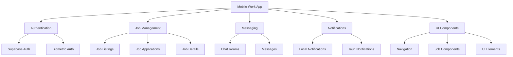

# Mobile Work App Codebase Optimization Plan

## Overview

This document outlines a comprehensive plan for optimizing the mobile work app codebase by identifying and removing unused code, redundant implementations, and outdated files. The analysis focuses on cleaning up the codebase to improve maintainability and performance.

## 1. Project Structure Analysis

### Main Functional Areas

### Technology Stack

- **Frontend**: Vue.js with Pinia for state management
- **Backend**: Supabase (PostgreSQL + Auth)
- **Mobile/Desktop**: Tauri (Rust-based framework)
- **Notifications**: Local and Tauri-based notifications
- **Authentication**: Supabase Auth with Biometric integration

## 2. Identified Optimization Opportunities

### A. OneSignal Code Removal

The application contains OneSignal integration code that is no longer being used:

- **Services**:

  - oneSignalService.js
  - tauriOneSignalPlugin.js

- **Composables**:

  - Any composables that reference OneSignal

- **Components**:
  - Any UI components specific to OneSignal

### B. Clerk Authentication Code Removal

The authentication system has been migrated from Clerk to Supabase, but there may still be legacy code:

- Any references to Clerk in authentication components
- Legacy auth patterns that were used with Clerk
- Unused auth-related components from the Clerk system

### C. Test and Debug Files

Several test and debug files that should be removed:

1. **Test Files**:

   - test-supabase-biometric-system.js
   - test-chat-notification.js
   - test-chat-notification-flow.js
   - test-biometric-system.js
   - test-fcm-direct.js
   - test-firebase-admin-setup.js
   - test-firebase-admin-setup.mjs
   - test_avatar_implementation.js
   - test_job_applications.js
   - test_supabase_avatar_implementation.js
   - test-complete-setup.js

2. **Debug Files**:
   - debug-navigation-issue.js

### D. Outdated Migration Guides

Migration guides that are no longer relevant:

- docs/clerk-to-supabase-migration-summary.md (if present)
- docs/SUPABASE_BIOMETRIC_AUTH_MIGRATION.md (if outdated)
- Any other migration guides that are no longer relevant

### E. Notification System Redundancies

The notification system has multiple overlapping implementations:

- **Redundant Composables**:

  - useNotifications.js
  - useFCM.js
  - usePushNotifications.js
  - useUnifiedNotifications.js (if it references OneSignal)

- **Services to Evaluate**:
  - fcmService.js
  - unifiedNotificationService.js (if it references OneSignal)

## 3. Detailed Removal Plan

### 1. OneSignal Code Removal

| File/Component                           | Action        | Reason                        |
| ---------------------------------------- | ------------- | ----------------------------- |
| oneSignalService.js                      | Remove        | OneSignal no longer used      |
| tauriOneSignalPlugin.js                  | Remove        | OneSignal no longer used      |
| ONESIGNAL_TAURI_MOBILE_EVALUATION.md     | Remove        | Outdated evaluation document  |
| Any components with OneSignal references | Modify/Remove | Remove OneSignal dependencies |
| unifiedNotificationService.js            | Modify        | Remove OneSignal references   |
| useUnifiedNotifications.js               | Modify        | Remove OneSignal references   |

### 2. Clerk Authentication Code Removal

| File/Component                         | Action        | Reason                                     |
| -------------------------------------- | ------------- | ------------------------------------------ |
| Any files with Clerk references        | Modify/Remove | Clerk no longer used                       |
| clerk-to-supabase-migration-summary.md | Remove        | Migration complete, guide no longer needed |
| Legacy auth components                 | Remove        | Replaced by Supabase auth components       |

### 3. Test and Debug Files Removal

| File                                   | Action | Reason                              |
| -------------------------------------- | ------ | ----------------------------------- |
| test-supabase-biometric-system.js      | Remove | Test file, not needed in production |
| test-chat-notification.js              | Remove | Test file for chat notifications    |
| test-chat-notification-flow.js         | Remove | Test file for notification flow     |
| test-biometric-system.js               | Remove | Test file for biometric system      |
| test-fcm-direct.js                     | Remove | Test file for FCM                   |
| test-firebase-admin-setup.js           | Remove | Test file for Firebase admin        |
| test-firebase-admin-setup.mjs          | Remove | Duplicate test file                 |
| test_avatar_implementation.js          | Remove | Test file for avatar feature        |
| test_job_applications.js               | Remove | Test file for job applications      |
| test_supabase_avatar_implementation.js | Remove | Test file for Supabase avatar       |
| test-complete-setup.js                 | Remove | Test file for setup process         |
| debug-navigation-issue.js              | Remove | Debug script for navigation issues  |

### 4. Notification System Cleanup

| Component                     | Action   | Reason                                                   |
| ----------------------------- | -------- | -------------------------------------------------------- |
| useFCM.js                     | Remove   | FCM likely not used if OneSignal is removed              |
| fcmService.js                 | Remove   | FCM likely not used if OneSignal is removed              |
| usePushNotifications.js       | Remove   | Push notifications handled differently now               |
| useNotifications.js           | Evaluate | May need to keep if it's the main notification interface |
| useUnifiedNotifications.js    | Modify   | Remove OneSignal references                              |
| unifiedNotificationService.js | Modify   | Remove OneSignal references                              |
| localNotificationService.js   | Keep     | Still needed for local notifications                     |
| tauriNotificationService.js   | Keep     | Still needed for Tauri notifications                     |

### 5. Documentation Cleanup

| File                                 | Action        | Reason                                  |
| ------------------------------------ | ------------- | --------------------------------------- |
| NOTIFICATION_SYSTEMS_COMPARISON.md   | Remove/Update | Contains outdated OneSignal comparisons |
| PUSH_NOTIFICATION_TESTING_GUIDE.md   | Remove/Update | Likely references OneSignal             |
| PUSH_NOTIFICATIONS_SETUP.md          | Remove/Update | Likely references OneSignal             |
| FCM_SERVER_KEY_SETUP_GUIDE.md        | Remove        | FCM likely not used                     |
| FIREBASE_FCM_AUTHENTICATION_GUIDE.md | Remove        | FCM likely not used                     |
| HYBRID_NOTIFICATION_SYSTEM.md        | Update        | Remove OneSignal references             |

## 4. Implementation Strategy

### Phase 1: Remove Test and Debug Files

1. Remove all test files listed in section 3.3
2. Remove debug-navigation-issue.js
3. Test the application to ensure no critical functionality is broken

### Phase 2: Remove OneSignal Code

1. Identify all OneSignal references in the codebase
2. Remove oneSignalService.js and tauriOneSignalPlugin.js
3. Update unifiedNotificationService.js to remove OneSignal references
4. Update any components that reference OneSignal
5. Test notification functionality to ensure it still works

### Phase 3: Clean Up Authentication System

1. Remove any remaining Clerk references
2. Remove clerk-to-supabase-migration-summary.md
3. Test authentication functionality to ensure it still works

### Phase 4: Clean Up Notification System

1. Remove FCM-related code if not being used
2. Consolidate notification composables
3. Test notification functionality to ensure it still works

### Phase 5: Update Documentation

1. Remove or update outdated documentation
2. Create new documentation reflecting the current state of the codebase

## 5. Risk Assessment

| Risk                                | Likelihood | Impact | Mitigation                                   |
| ----------------------------------- | ---------- | ------ | -------------------------------------------- |
| Breaking notification functionality | Medium     | High   | Test thoroughly after each phase             |
| Auth system disruption              | Low        | High   | Keep core Supabase auth functionality intact |
| Missing dependencies                | Medium     | Medium | Check for dependencies before removing files |
| UI inconsistencies                  | Low        | Medium | Test UI components after changes             |

## 6. Next Steps

1. Begin with Phase 1 (Remove Test and Debug Files)
2. Validate application functionality after each phase
3. Document all changes made
4. Update relevant documentation to reflect the current state of the codebase
