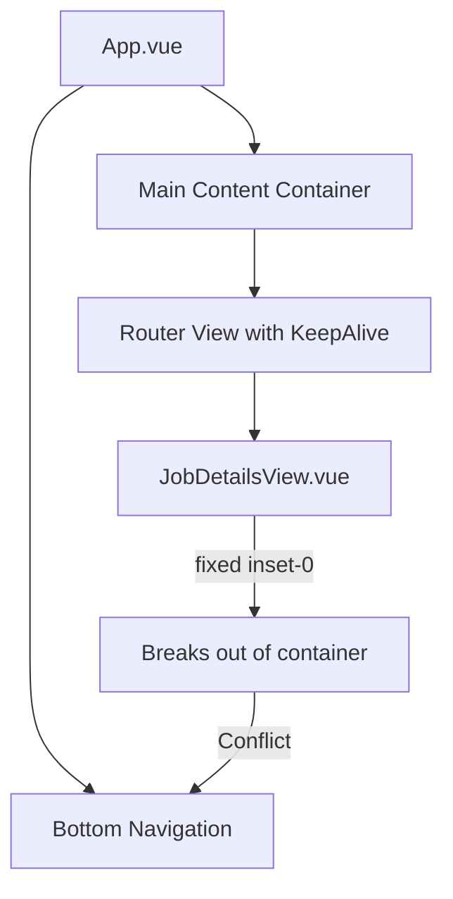
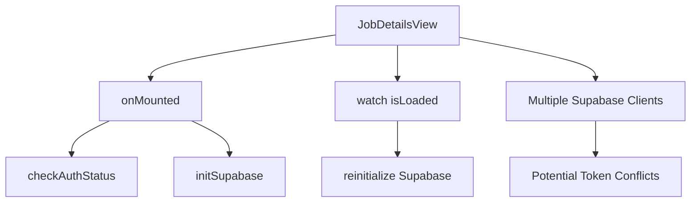

# Navigation/Authentication Issue Analysis

## 1. Problem Summary

When a user navigates to JobDetailsView.vue and then tries to navigate to another route using the bottom navigation, no content shows and navigation becomes unresponsive.

## 2. Key Findings from Code Analysis

### App Structure Issues



1. **Fixed Positioning Conflict**:

   - JobDetailsView uses `fixed inset-0 bg-background overflow-y-auto` positioning
   - This positioning takes over the entire viewport, potentially trapping events
   - The comment "Break out of App.vue container constraints" confirms this is intentional

2. **Z-index Conflicts**:
   - Bottom navigation has `z-index: 50`
   - JobDetailsView has elements with `z-index: 60` (sticky bottom action bar)
   - This creates a layering conflict where JobDetailsView elements may overlay navigation

### Authentication Flow Issues



1. **Multiple Supabase Client Initializations**:

   - JobDetailsView initializes its own Supabase client
   - The job store also initializes a Supabase client
   - This could lead to token conflicts or race conditions

2. **Complex Authentication Watchers**:
   - Multiple watchers for authentication state changes
   - Reinitializes Supabase client when auth state changes
   - Could cause issues during navigation if auth state is in flux

### Lifecycle and State Management Issues

1. **KeepAlive with Fixed Positioning**:

   - JobDetailsView has `keepAlive: true` in route meta
   - Combined with fixed positioning, this could cause the component to remain in the DOM
   - May prevent other views from properly rendering

2. **Multiple onMounted Hooks**:
   - JobDetailsView has multiple onMounted hooks
   - One fetches job data, another checks if user has applied
   - Could lead to race conditions or incomplete cleanup

## 3. Potential Root Causes (Prioritized)

1. **Fixed Positioning Breaking Layout**:

   - The `fixed inset-0` positioning takes JobDetailsView out of the normal document flow
   - When navigating away, it may not be properly removed from the DOM due to keepAlive
   - This would block other content from showing

2. **Z-index Conflicts**:

   - The sticky bottom action bar with `z-index: 60` may be overlaying the bottom navigation
   - This could make navigation appear unresponsive by blocking click events

3. **Authentication State Persistence**:

   - Supabase client initialization in multiple places could lead to token conflicts
   - If authentication state is not properly cleaned up, it could affect subsequent navigation

4. **Incomplete Component Cleanup**:

   - No explicit cleanup in beforeUnmount or deactivated lifecycle hooks
   - Resources and event listeners may not be properly released

5. **Router View Transition Issues**:
   - Page transitions combined with fixed positioning could cause rendering issues
   - The transition timing might not account for the fixed positioning elements

## 4. Recommended Investigation Steps

1. **Modify Fixed Positioning**:

   - Test replacing `fixed inset-0` with a different approach that doesn't break out of the container
   - Consider using `absolute` positioning within a relative container

2. **Add Proper Cleanup**:

   - Implement `beforeUnmount` and `deactivated` lifecycle hooks to clean up resources
   - Ensure Supabase clients and authentication state are properly reset

3. **Adjust Z-index Hierarchy**:

   - Ensure bottom navigation has a higher z-index than any content in JobDetailsView
   - Review all z-index values to establish a clear hierarchy

4. **Implement Navigation Guards**:

   - Add specific navigation guards for transitions to/from JobDetailsView
   - Ensure authentication state is properly handled during navigation

5. **Test with Authentication Disabled**:
   - Temporarily disable authentication to see if the issue persists
   - This would help isolate whether the problem is related to auth or purely layout

## 5. Specific Code Areas to Investigate

1. **JobDetailsView.vue**:

   - The `fixed inset-0` positioning in the root div
   - The sticky bottom action bars with high z-index values
   - Multiple onMounted hooks without corresponding cleanup

2. **App.vue**:

   - The bottom navigation implementation and z-index
   - The router-view transition handling

3. **Authentication Integration**:

   - The Supabase client initialization in multiple places
   - Token management within Supabase (session handling)

4. **Router Configuration**:
   - The keepAlive meta property for JobDetailsView
   - Navigation guards that might affect transitions

## 6. Proposed Solutions

### Short-term Fixes

1. **Fix Fixed Positioning**:

   ```vue
   <!-- Before -->
   <div class="fixed inset-0 bg-background overflow-y-auto">
     <!-- content -->
   </div>

   <!-- After -->
   <div class="relative min-h-screen bg-background overflow-y-auto">
     <!-- content -->
   </div>
   ```

2. **Add Cleanup Hooks**:

   ```vue
   <script setup>
   // Existing code...

   // Add cleanup hook
   onBeforeUnmount(() => {
     // Reset Supabase client
     supabaseRef.value = null;
     // Clear any timers or listeners
     // ...
   });
   </script>
   ```

3. **Fix Z-index Hierarchy**:
   ```vue
   <!-- In App.vue, increase bottom nav z-index -->
   <nav
     class="md:hidden fixed bottom-0 left-0 right-0 bg-card shadow-lg border-t border-border z-[100]"
   >
     <!-- navigation content -->
   </nav>
   ```

### Long-term Architectural Improvements

1. **Centralize Supabase Client Management**:

   - Use a single instance of the Supabase client throughout the app
   - Implement proper token refresh and error handling

2. **Improve Component Lifecycle Management**:

   - Add explicit activated/deactivated hooks for components with keepAlive
   - Ensure proper cleanup of resources and state

3. **Refactor Layout Structure**:
   - Create a consistent layout system that doesn't require breaking out of containers
   - Use proper stacking contexts for z-index management
